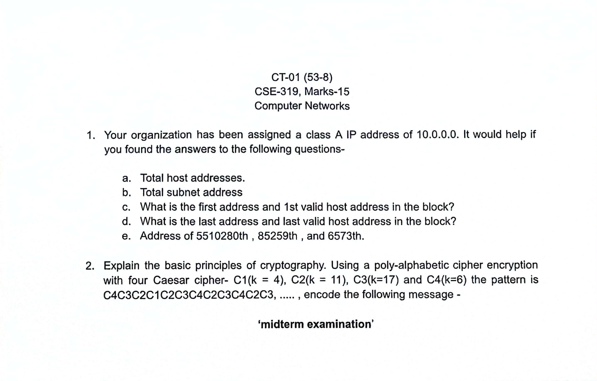

# CT Question (S5)

## Scenario 1

A video conferencing application works smoothly at night but suffers noticeable lag during office hours.

1. **Which type of network delay are responsible for this behavior?**

    **Ans.:** In the given scenario, we are told that there is a video conferencing application that works smoothly at night but suffers noticeable lag during the office hours. This noticeable lag occurs due to **network congestion** which increases **queuing delay**.

    However, there are two more delays that might contribute to the lag: **processing** and **transmission delays**.

    **Propagation delay** is not a major factor since it does not change with time of day.

2. **Explain how each delay contributes to the overall E2E delay.**

    **Ans.:** There are three delays that contribute to the noticeable lag in the aforementioned scenario:
    1. Queuing Delay
    2. Processing Delay
    3. Transmission Delay

    Here is how they contribute to the overall E2E delay:

    <ins><strong>Queuing Delay (Primary cause):</strong></ins> During office hours, many users share the network. Routers and switches get congested and the packets wait in _queues_ before being forwarded. This results in significantly longer waiting times. But during night, there are few users sharing the network. So, there are shorter queues and no noticeable performance drop.

    <ins><strong>Processing Delay:</strong></ins> Under heavy traffic, routers process more packets, slightly increasing this delay.

    <ins><strong>Transmission Delay:</strong></ins> During congestion, effective available bandwidth per user drops, increasing transmission time. This can worsen real-time video performance during peak hours.

## Scenario 2

A package of **1,500 bytes** in size is sent over a link with a transmission rate of **10 Mbps** and a propagation delay of **20 ms**.

1.  **Calculate the transmission delay.**

    **Ans.:** Calculating the tranmission delay according to the said scenario:

    We know,

        1 byte = 8 bits
        Therefore, 1500 bytes = 12000 bits (packet size)

    We have,
    Transmission Rate,

        R = 10 Mbps = 10 × 10^6 bits/second

    We know,
    Transmission Delay,

        Td = Packet size / R
           = 12000 / (10 × 10^6)
           = 0.0012 s
           = 1.2 ms

2.  **Explain why transmission delay and propagation delay are independent of each other.**

    **Ans.:** Transmission delay and propagation delay depend on _different physical factors_, so changing one does not affect the other.

    Transmission delay (**Td**) occurs while bits are being put onto the link. So, it depends on **packet size** and **transmission rate**. Formula:

        Td = L / R
           Where, L = Packet size
                  R = Transmission Rate

    Propagation Delay (**pD**) occurs while bits are traveling through the link. It depends on **physical distance of the link** and **speed of signal in the medium**. So changing packet size or bandwidth will **NOT** affect propagation delay.

# CT Question (S8)

## Scenario 1

Your organization has been assigned a class A IP address of 10.0.0.0. It would help (them) if you found the answers to the following questions -

1.  **Total host addresses**

    **Ans.:** Since the IP address of the organization is 10.0.0.0 which is a **class A** IP address,

        Subnet mask   : 255.0.0.0 (Default)
        Prefix length : /8
        Host bits     : 32 − 8 = 24

    So, there are **2^24** host addresses, where **2^24 − 2** of them are valid.

2.  **Total subnet addresses**

    **Ans.:** For a default Class A network (no subnetting applied), there is only 1 subnet address (**255.0.0.0**)

3.  **First address and first valid host address in the block**

    **Ans.:**

        First network address    : 10.0.0.0
        First valid host address : 10.0.0.1

4.  **Last address and last valid host address in the block**

    **Ans.:**

        Last network address    : 10.255.255.255
        Last valid host address : 10.255.255.254

5.  **Address of 55,10,280th, 85,259th and 6,573th**

    **Ans.:** From the given scenario, the first 8 bits of the 32-bit address is fixed (10)

        Binary of 10      = 00001010
        ∴ Network address = 10.A.B.C

    Here, A-C denotes the remaining 24 bits of the address. Since the first valid host starts at 1, we need to substract 1 from the `n`th host.

    <ins><strong>55,10,280th Host</strong></ins>

        5510280 − 1 = 5510279
        5510279 = 01010100 00001111 11010111
                    84       15       215

    ∴ Final IP address **`10.84.15.215`**

    <ins><strong>85,259th Host</strong></ins>

        85259 − 1 = 85258
        85258 = 00000001 01001101 00001010
                    1       77       10

    ∴ Final IP address **`10.1.77.10`**

    <ins><strong>6,573th</strong></ins>

        6573 − 1 = 6572
        6572 = 00000000 00011001 10101100
                    0      25      172

    ∴ Final IP address **`10.0.25.172`**

## Scenario 2

Explain the basic principles of cryptography. Using a poly-alphabetic cipher encryption with four Caesar cipher -

1. C1 (**k = 4**)
2. C2 (**k = 11**)
3. C3 (**k = 17**)
4. C4 (**k = 6**)

The pattern is:

    C4 C3 C2 C1 C2 C3 C4 C2 C3 C4 C2 C3

Encode the following message:

    midterm examination

**Ans.:** Cryptography is the science of protecting information by transforming it into an unreadable form so that only authorized parties can understand it.

The basic principles are:

1. **Confidentiality:** Ensures that information is accessible only to authorized users (achieved using encryption)

2. **Integrity:** Ensures that data is not altered during transmission or storage.

3. **Authentication:** Verifies the identity of the sender and receiver of information.

4. **Non-repudiation:** Prevents a sender from denying that they sent a message.

A poly-alphabetic cipher uses multiple substitution alphabets. Each character is encrypted using a different Caesar cipher key, based on a repeating pattern.

Given Caesar Ciphers,

1. C1 (**k = 4**)
2. C2 (**k = 11**)
3. C3 (**k = 17**)
4. C4 (**k = 6**)

Encryption Pattern,

    C4 C3 C2 C1 C2 C3 C4 C2 C3 C4 C2 C3

We know,

Alphabet–Number Mapping,

    A = 0
    B = 1
    ...,
    Z = 25

Caesar Cipher Formula,

    C = (P + k) % 26
        where,
            P = plaintext letter value
            k = key
            C = ciphertext letter value

Now,

    Original message  : midterm examination
    Encrypted message : szoxpis pogxztlkoze

Encryption Table,

| Letter | P   | Cipher | k   | Calculation    | C   | Result |
| ------ | --- | ------ | --- | -------------- | --- | ------ |
| m      | 12  | C4     | 6   | (12+6) mod 26  | 18  | s      |
| i      | 8   | C3     | 17  | (8+17) mod 26  | 25  | z      |
| d      | 3   | C2     | 11  | (3+11) mod 26  | 14  | o      |
| t      | 19  | C1     | 4   | (19+4) mod 26  | 23  | x      |
| e      | 4   | C2     | 11  | (4+11) mod 26  | 15  | p      |
| r      | 17  | C3     | 17  | (17+17) mod 26 | 8   | i      |
| m      | 12  | C4     | 6   | (12+6) mod 26  | 18  | s      |
| e      | 4   | C2     | 11  | (4+11) mod 26  | 15  | p      |
| x      | 23  | C3     | 17  | (23+17) mod 26 | 14  | o      |
| a      | 0   | C4     | 6   | (0+6) mod 26   | 6   | g      |
| m      | 12  | C2     | 11  | (12+11) mod 26 | 23  | x      |
| i      | 8   | C3     | 17  | (8+17) mod 26  | 25  | z      |
| n      | 13  | C4     | 6   | (13+6) mod 26  | 19  | t      |
| a      | 0   | C2     | 11  | (0+11) mod 26  | 11  | l      |
| t      | 19  | C3     | 17  | (19+17) mod 26 | 10  | k      |
| i      | 8   | C4     | 6   | (8+6) mod 26   | 14  | o      |
| o      | 14  | C2     | 11  | (14+11) mod 26 | 25  | z      |
| n      | 13  | C3     | 17  | (13+17) mod 26 | 4   | e      |
