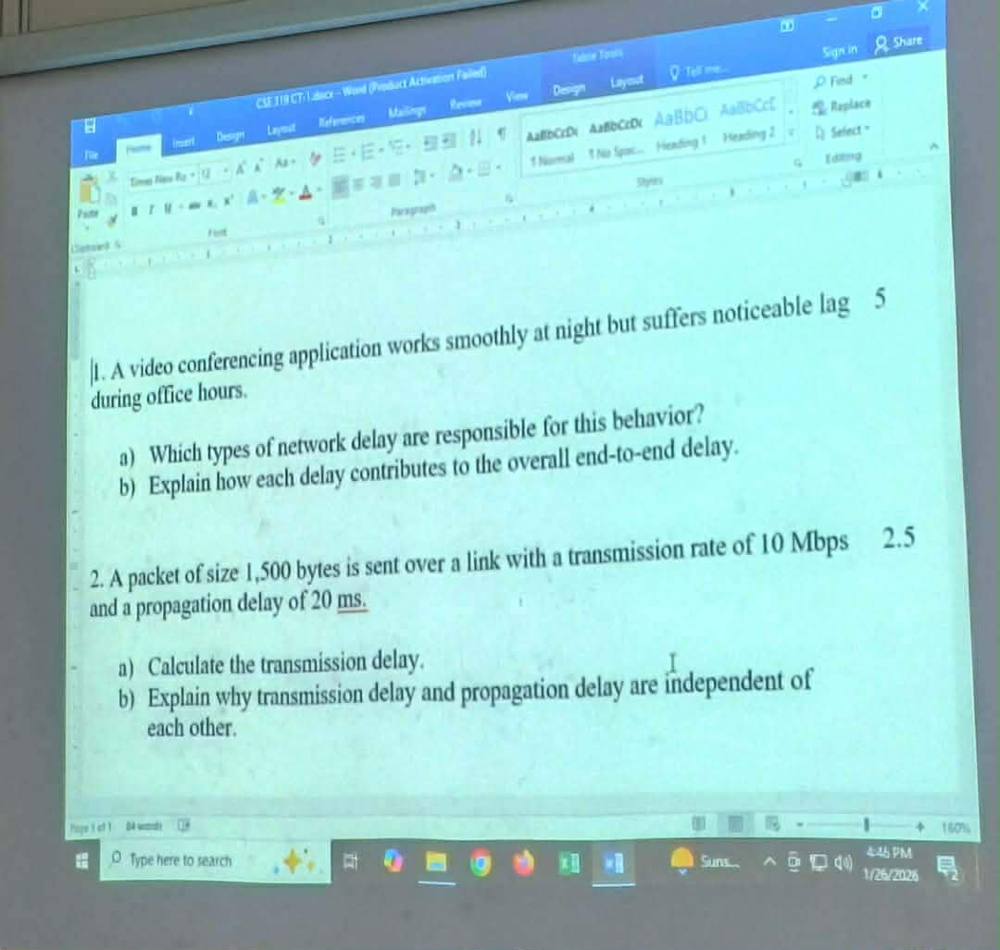

# CT Question (Section 5)

## Scenario 1

A video conferencing application works smoothly at night but suffers noticeable lag during office hours.

1. **Which type of network delay are responsible for this behavior?**

    **Ans.:** In the given scenario, we are told that there is a video conferencing application that works smoothly at night but suffers noticeable lag during the office hours. This noticeable lag occurs due to **network congestion** which increases **queuing delay**.

    However, there are two more delays that might contribute to the lag: **processing** and **transmission delays**.

    **Propagation delay** is not a major factor since it does not change with time of day.

2. **Explain how each delay contributes to the overall E2E delay.**

    **Ans.:** There are three delays that contribute to the noticeable lag in the aforementioned scenario:
    1. Queuing Delay
    2. Processing Delay
    3. Transmission Delay

    Here is how they contribute to the overall E2E delay:

    <ins><strong>Queuing Delay (Primary cause):</strong></ins> During office hours, many users share the network. Routers and switches get congested and the packets wait in _queues_ before being forwarded. This results in significantly longer waiting times. But during night, there are few users sharing the network. So, there are shorter queues and no noticeable performance drop.

    <ins><strong>Processing Delay:</strong></ins> Under heavy traffic, routers process more packets, slightly increasing this delay.

    <ins><strong>Transmission Delay:</strong></ins> During congestion, effective available bandwidth per user drops, increasing transmission time. This can worsen real-time video performance during peak hours.

## Scenario 2

A package of **1,500 bytes** in size is sent over a link with a transmission rate of **10 Mbps** and a propagation delay of **20 ms**.

1.  **Calculate the transmission delay.**

    **Ans.:** Calculating the tranmission delay according to the said scenario:

    We know,

        1 byte = 8 bits
        Therefore, 1500 bytes = 12000 bits (packet size)

    We have,
    Transmission Rate,

        R = 10 Mbps = 10 × 10^6 bits/second

    We know,
    Transmission Delay,

        Td = Packet size / R
           = 12000 / (10 × 10^6)
           = 0.0012 s
           = 1.2 ms

2.  **Explain why transmission delay and propagation delay are independent of each other.**

    **Ans.:** Transmission delay and propagation delay depend on _different physical factors_, so changing one does not affect the other.

    Transmission delay (**Td**) occurs while bits are being put onto the link. So, it depends on **packet size** and **transmission rate**. Formula:

        Td = L / R
           Where, L = Packet size
                  R = Transmission Rate

    Propagation Delay (**pD**) occurs while bits are traveling through the link. It depends on **physical distance of the link** and **speed of signal in the medium**. So changing packet size or bandwidth will **NOT** affect propagation delay.
