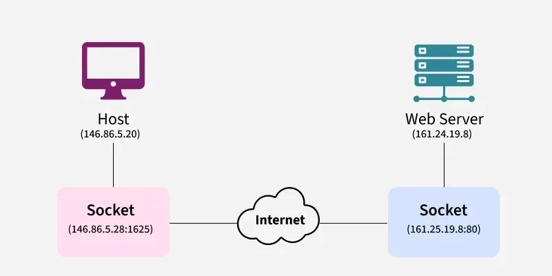

## Mid Term Examination

### Topic List

1. [**Definitions**](#definitions)
    - Throughput
    - Network Protocol
    - Internet
    - Hosts & Links
    - Packet Loss
    - Packet Switching
    - Circuit Switching
    - Delay
    - Latency
    - Routing and Forwarding
    - FDM & TDM
    - Bottleneck Link
    - Virus & Worm, Botnet
    - DoS
    - Packet Interception
    - RTT (Round Trip Time)
    - Caesar Cipher
    - Acknowledgment Number
    - TTL (Time to Live)
    - Hop
    - Subnet Mask
    - Default Gateway
    - Subnetting

2. [**Theoretical Question**](#theoretical-questions)
    - **Chapter I**
        - [Explain Throughput and Bandwidth](#11-explain-throughput-and-bandwidth)
        - [Packet Switching vs Circuit Switching](#12-packet-switching-vs-circuit-switching)
        - [Four Types of E2E Delays](#13-four-types-of-e2e-delays)
        - [Packet Interception](#14-packet-interception)
        - [DDoS Attack](#15-ddos-attack)
        - [Why Layering is Required in Networking?](#16-why-layering-is-required-in-networking)
        - Elaborate Internet Protocol Stack
        - [Cerf and Khan’s Internetworking Principles](#18-cerf-and-khans-internetworking-principles)
        - Reference Models: OSI, ISO, TCP/IP
        - [End-to-End Communication](#110-end-to-end-communication)
        - [End-to-End Throughput](#111-end-to-end-throughput)
        - [Why do packet loss and delay occur?](#112-why-do-packet-loss-and-delay-occur)

    - **Chapter II**
        - [Client-Server Model](#21-client-server-model)
        - [Peer-to-Peer Model](#22-peer-to-peer-model)
        - [Sockets](#23-sockets)
        - [IP Addressing Method](#24-ip-addressing-method)
        - Web (HTTP) Protocol
        - HTTP Connection Types
        - HTTP Request Methods
        - HTTP Response Codes
        - Maintaining User/Server States (Cookies)
        - Components of Cookies
        - Cookie Mechanism
        - Web Caching (Proxy Servers) with Example
        - Conditional GET
        - Mitigating HOL Blocking (HTTP/2)
        - SMTP and its Components
        - IMAP
        - DNS: Services & Structure
        - DNS: Tree
        - TLD & Authoritative DNS
        - Queries: Iterated & Recursive
        - DNS Records: Components
        - FTP: Process, Commands & Status Codes
        - POP3 IMAP
        - IP Addressing: Classes A-E
        - Cryptographic Components

    - **Chapter III**
        - TCP vs UDP
        - UDP Segment Headers
        - TCP Segment Structure

    - **Chapter IV**
        - IPv4 Packet Structure
        - IPv6 Packet Structure
        - What happens when TTL is zero?
        - What is a fragment?
        - Explain each field in IP Datagram (v4, v6)
        - IPv6 Flow Label
        - TCP Congestion Control: AIMD
        - Why is AIMD used?
        - TCP Slow Starts

3. [**Mathematical Questions**](#mathematical-questions)
    - Packet Queueing Delay
    - Nodal Delay
    - IP Addressing
    - Identify Class by converting IP to Binary
    - Monoalphabetic and Polyalphabetic Cipher
    - Internet Checksum
    - TCP RTT
    - TCP Timeout

### Full Forms

| Abbreviation | Full Form                                 |
| :----------- | :---------------------------------------- |
| FDM          | Frequency Division Multiplexing           |
| TDM          | Time-Division Multiplexing                |
| DoS          | Denial of Service                         |
| DDoS         | Distributed Denial of Service             |
| ACK          | Acknowledgment Number                     |
| RTT          | Round Trip Time                           |
| TTL          | Time to Live                              |
| AP           | Access Point                              |
| LAN          | Local Area Network                        |
| AIMD         | Additive Increase/Multiplicative Decrease |
| P2P          | Peer-to-Peer                              |
| CDN          | Content Delivery Network                  |
| VPN          | Virtual Private Network                   |
| DHCP         | Dynamic Host Configuration Protocol       |
| CIDR         | Classless Inter-Domain Routing            |
| APIPA        | Automatic Private IP Addressing           |

### Definitions

- <ins><strong>Throughput:</strong></ins> The actual rate of successful data delivery over a network channel within a specific period of time.

- <ins><strong>Network Protocol:</strong></ins> A standardized set of rules, conventions, and data structures that govern how devices on a network format, transmit, receive, and interpret data.

- <ins><strong>Internet:</strong></ins> A global, _decentralized network_ of interconnected computers and devices using standardized protocols (**TCP/IP**) to communicate, acting as a "network of networks" to facilitate information exchange.

- <ins><strong>Host:</strong></ins> Any device connected to a network that has a unique IP address, enabling it to send, receive, and share data.

- <ins><strong>Link:</strong></ins> The physical or logical communication pathway connecting two or more nodes to allow data transmission. **Links are the foundation for network communication.**

- <ins><strong>Packet Loss:</strong></ins> Occurs when data packets fail to reach their destination on a network.

- <ins><strong>Packet Switching:</strong></ins> A fundamental, efficient data transmission method where data is broken into smaller _packets_ that travel accross a network (like Internet) to a destination.

- <ins><strong>Circuit Switching:</strong></ins> A _connection-oriented network technique_ that establishes a dedicated, exclusive physical path between two endpoints for the entire duration of a session.

- <ins><strong>Delay:</strong></ins> The total time that a packet takes to travel from the source to destination across a network.

- <ins><strong>Latency:</strong></ins> The time between data entering a device and leaving it.

- <ins><strong>Routing:</strong></ins> The process of selecting the best, most efficient paths for data packets to travel across interconnected networks from source to destination.

- <ins><strong>Forwarding:</strong></ins> The action a router or switch takes to pass a data packet from an input to the correct output, moving it closer to the destination.

- <ins><strong>Frequency Division Multiplexing (FDM):</strong></ins> An analog technique that combines multiple signals onto a single communication channel by assigning each signal a unique, non-overlapping frequency band.

- <ins><strong>Time-Division Multiplexing (TDM):</strong></ins> A networking technique that transmits multiple, independent data streams over a single channel by separating the signal into distinct, fixed-duration time slots.

- <ins><strong>Bottleneck Link:</strong></ins> The slowest or most constrained link along a data path, restricting overall maximum throughput of a connection.

- <ins><strong>Virus:</strong></ins> A malware that replicates by inserting its code into programs and boot sectors, requiring a host program to activate and spread across networks.

- <ins><strong>Worm:</strong></ins> A standalone, self-replicating malware that spreads across networks without requiring a host file or user interaction.

- <ins><strong>Botnet:</strong></ins> A collection of internet-connected, malware-infected devices (clients and servers) remotely controlled by a single attacker, known as a **Bot Herder**.

- <ins><strong>Denial of Service (DoS):</strong></ins> A malicious attempt to disrupt normal traffic of a targeted server, service, or network by overwhelming it with a flood of illegitimate requests, rendering it inaccessible to legitimate users.

- <ins><strong>Packet Interception:</strong></ins> Also known as **sniffing**, the act of capturing, monitoring, and analyzing data packets traversing a network to inspect their contents, such as unencrypted logins, passwords, and user traffic.

- <ins><strong>Round Trip Time (RTT):</strong></ins> The total time for a network request to travel from source to destination and returning back to the source again.

- <ins><strong>Caesar Cipher:</strong></ins> A **foundational**, simple substitution encryption technique in network security where each letter in plaintext is replaced by another letter a fixed number of positions down or up the alphabet.

- <ins><strong>Acknowledgment Number (ACK):</strong></ins> A 32-bit filed in the TCP header that indicates the sequence number of the next expected byte of data from the sender.

- <ins><strong>Time to Live (TTL):</strong></ins> A mechanism that _limits_ the lifespan of data (packets or DNS records), preventing from circulating indefinitely in a network.

- <ins><strong>Hop:</strong></ins> Occurs when a packet is passed from one network segment to the next.

- <ins><strong>Subnet Mask:</strong></ins> A 32-bit number paired with an IP address to divide it into network and host components, determining which part identifies the network and which identifies the host.

- <ins><strong>Default Gateway:</strong></ins> A network node (or router) that serves as the AP for data traversing from a LAN to external networks (the Internet).

- <ins><strong>Subnetting:</strong></ins> The logical process of dividing a large physical IP network into smaller, manageable sub-networks (_subnets_) to improve network performance, security, and address efficiency.

### Theoretical Questions

Thanks to **Amrin Jahan** for helping me write some of the answers given here.

#### 1.1. Explain Throughput and Bandwidth

<ins><strong>Throughput:</strong></ins> The actual rate of successful data delivery over a network channel within a specific period of time, typically measured in Mbps or Gbps.

> _If a network **sends 100 Mb data in 1 second**, the throughput is 100 Mbps._

<ins><strong>Bandwidth:</strong></ins> The (theoretical) maximum amount of data that can be sent through a network channel within a specific period of time.

> _If a network **can send up to 100 Mbps data**, then the bandwidth is 100 Mbps._

<ins><strong>Advantages and Disadvantages of Throughput:</strong></ins>

| **Advantages**                                | **Disadvantages**                             |
| :-------------------------------------------- | :-------------------------------------------- |
| • Higher system performance,                  | • Many factors may reduce throughput,         |
| • Efficient data transfer,                    | • Inconsistent at times,                      |
| • Medium of comparison of different networks. | • Does NOT reveal the true delay information. |

<ins><strong>Advantages and Disadvantages of Bandwidth:</strong></ins>

| **Advantages**                          | **Disadvantages**              |
| :-------------------------------------- | :----------------------------- |
| • (Theoretically) Higher data capacity, | • Costly,                      |
| • Better network performance,           | • Possibility of wastage,      |
| • Less congestion.                      | • Does NOT translate to speed. |

<ins><strong>Difference between Throughput and Bandwidth:</strong></ins>

| **Throughput**                                          | **Bandwidth**                                      |
| :------------------------------------------------------ | :------------------------------------------------- |
| The actual data rate sent through the network           | The theoretical maximum data capacity of a network |
| Shows how much data is _really sent_                    | Shows how much data _can be sent_                  |
| Measured usually in **Mbps, Gbps**                      | Measured usually in **Mbps, MBps,** or **Gbps**    |
| Throughput _can change_ depending on network conditions | Bandwidth is _fixed_                               |
| High throughput indicates high performance              | High bandwidth does NOT translate to high speed    |
| Depends on network traffic, delays, and errors          | Depends on network design and hardware             |

---

#### 1.2. Packet Switching vs Circuit Switching

| **Feature**       | **Packet Switching**      | **Circuit Switching** |
| :---------------- | :------------------------ | :-------------------- |
| **Connection**    | NO dedicated path         | Dedicated path        |
| **Dataflow**      | Data divided into packets | Continuous            |
| **Bandwidth Use** | Efficient                 | Inefficient           |
| **Delay**         | Variable                  | Fixed/predictable     |
| **Reliability**   | Network dependent         | Very high             |
| **Example**       | Internet                  | Telephone call        |

---

#### 1.3. Four Types of E2E Delays

End-to-end (E2E) delay is the total time a packet takes to travel from source to destination across a network. There are four key components of the E2E delay:

- <ins><strong>Transmission Delay (Dtrans):</strong></ins> The time required to push all bits of a data packet onto a network link.

<pre>Dtrans = L / R
   Where, L = Packet size
          R = Transmission Rate or Bandwidth</pre>

- <ins><strong>Propagation Delay (Dprop):</strong></ins> The time it takes for a signal (bit) to travel from sender to receiver across a physical medium.
    - Signal speed: <strong>2×108 ms-1</strong> for fiber optic cables.
    - Unlike transmission delay, propagation delay is independent of the data rate or packet size.

<pre>Dprop = Distance / Speed</pre>

- <ins><strong>Processing Delay (Dproc):</strong></ins> The time required for network devices (<strong>routers, switches, firewalls</strong>) to examine a packet's header, determine its destination, check for errors and perform security checks.

- <ins><strong>Queuing Delay (Dqueue):</strong></ins> The time a data packet spends waiting in a network device's buffer (queue) before it is transmitted, occurring when incoming traffic exceeds the outgoing link's capacity. **It is a major, variable source of network latency and congestion.**

**Calculating E2E Delay:**

<pre>De2e&nbsp;=&nbsp;Dtrans&nbsp;+&nbsp;Dprop&nbsp;+&nbsp;Dproc&nbsp;+&nbsp;Dqueue</pre>

---

#### 1.4. Packet Interception

Also known as **packet sniffing**, packet interception the act of capturing, monitoring, and analyzing data packets traversing a network to inspect their contents, such as unencrypted logins, passwords, and user traffic.

<ins><strong>Use Cases:</strong></ins>

- **Network Troubleshooting:** Identifying performance bottlenecks, congestion, and packet loss.
- **Security Analysis:** Detecting intrusions, malware, and suspicious traffic patterns.
- **Forensics:** Creating network activity log for investigation purposes.

<ins><strong>Techniques of Interception:</strong></ins>

- **SPAN**/Mirroring
- **Network TAPs**
- Software Sniffers (**Wireshark**)

<ins><strong>Prevention and Defence:</strong></ins>

- **Encryption:** Using HTTPS, SSL/TLS, and VPNs to make captured data unreadable.
- **Network Segmentation:** Limits the scope of what someone can monitor.
- **Secured Infrastructure:** Using secure switches and disabling unused ports to prevent unauthorized monitoring.

---

#### 1.5. DDoS Attack

A Distributed Denial of Service (**DDOS**) attack is a malicious attempt to disrupt a server, service or network by overwhelming it with a flood of internet traffic from multiple, _often compromised_ sources (a botnet).

- **Working Principle:** Attackers use malware to infect devices, turning them into **bots**. A message network of these bots then turn into a **botnet**, and are instructed to send requests to a specific target's IP address, overwhelming the server's capacity.

- **Consequence:** It renders online services inaccessible to legitimate users, causing downtime and revenue loss.

- **Mitigation:** Protection involves -
    - using CDNs,
    - increasing bandwidth,
    - implementing rate limiting, and
    - using cloud-based scrubbing centers to filter traffic.

---

#### 1.6. Why Layering is Required in Networking?

> _Layering in a network is necessary to reduce the complexity of the communication process and to provide modularity._

Communication over a network involves many functions such as addressing, routing, error control, data formatting, and session management. If all these functions were handled together as a monolithic design, it would become extremely difficult to manage, troubleshoot, or update.

Layering divides the communication process into a series of distinct steps, each handled by a different layer. Each layer performs a specific set of functions and interacts with the layers directly above and below it. This abstraction simplifies the design and implementation of network protocols, promotes interoperability, and allows different technologies to coexist and evolve independently.

---

#### 1.8. Cerf and Khan’s Internetworking Principles

> _**Vint Cerf** and **Bob Kahn** formulated the fundamental principles of internetworking in **1973–1974**_

Here are the key Internetworking Principles established by Cerf and Kahn:

1. **Core Design Principle**
    - Open-Architecture Networking
    - Minimalism and Autonomy
    - Best-Effort Service Model
    - Stateless Routers (Gateways)

2. **Architectural Principles**
    - End-to-End Reliability
    - Unified Addressing System
    - Gateways/Routers
    - Fragmentation

#### 1.10. End-to-end Communication

End-to-end (E2E) communication is a networking principle where data is transmitted directly from the source to the destination without intervention from intermediate nodes.

- End-to-end connectivity ensures a seamless, uninterrupted connection often using acknowledgement messages (ACK) to confirm data receipt.

- This approach places responsibility for functionality (reliability, security) at the network's endpoints rather than in the core.

- **Example:** An arbitrarily reliable file transfer between two endpoints in a distributed network.

- **Limitation:** The most important limitation of the end-to-end principle is that its basic premise, place functions in the application endpoints rather than in the intermediary node, which is hard to implement properly.

---

#### 1.11. End-to-End Throughput

End-to-end throughput is the total rate of successful data transfer (bits/second) from source to destination across a network path, typically determined by the bottleneck link along that path.

<pre>
Throughput = min(<i>R1</i>, <i>R2</i>, ..., <i>Rn</i>)
</pre>

- When _**N**_ connections share a link (**R**), the throughput per connection is **R / N**.

- **Instantaneous throughput** measures the rate at a specific moment, while **average throughput** calculates it over a sustained period.

- **Example:** The lower of the server's upload speed or the client's download speed often acts as the bottleneck (end-to-end throughput)

<ins><strong>Factors affecting throughput:</strong></ins>

- **Wireless Interference:** Hidden nodes and simultaneous transmissions.
- **Protocol Overhead:** TCP/IP headers and acknowledgments.
- **Network Congestion:** High traffic load can lead to packet loss and retransmissions.

---

#### 1.12. Why do packet loss and delay occur?

- **Network Congestion:** During peak hours, data traffic exceeds network capacity, leading to queuing delays and dropped packets.

- **Hardware/Software Issues:** Outdated firmware, overheated routers, or faulty cables can fail to process packets, causing them to be lost or delayed.

- **Wireless Signal Interference:** Physical obstructions or electromagnetic interference can corrupt data packets in Wi-Fi, resulting in packet loss.

- **Buffer Overflows:** When a network device receives more data than its memory buffer can hold, it drops incoming packets.

- **Routing/Configuration Errors:** Misconfigured network devices can cause packets to loop or be dropped.

#### 2.1. Client-Server Model

The client-server model is a distributed application structure where a client (_e.g., a web browser_) sends requests for data or services to a server (_e.g., a web server_), which processes them and returns a response.

**Server:**

- Always-on host
- Has apermanent IP address
- Often used in data centers for scaling capabilities

**Clients:**

- Contact, communicate with server
- Maybe intermittently connected
- May have dynamic IP addresses
- Do not communicate directly with each other

Example protocols that establishes a client-server model: **HTTP**, **IMAP**, **FTP**.

---

#### 2.2. Peer-to-Peer Model

A peer-to-peer (**P2P**) model is a decentralized network architecture where individual computers, or "peers," act as both clients and servers, directly sharing resources like files, processing power, or storage without a central authority.

- There is NO always-on server.
- Arbitrary end systems directly communicate with each other.
- Peers request service from other peers, providing service in return to other peers.
- **Self scalability:** new peers bring new service capacity, as well as new service demands.
- Peers are intermittently connected and change IP addresses.
- **Example:** P2P file sharing.

---

#### 2.3. Sockets

A network socket is the software-defined, bidirectional endpoint of a communication link between two programs running on a network. **Sockets are essential for client-server communication, enabling processes to exchange data over protocols like TCP or UDP.**

 <i>figure 2.3: Sockets in Networking</i>

<ins><strong>Types:</strong></ins>

- **Stream Sockets (TCP):** Provide reliable, ordered, and error-checked delivery of data, commonly used for HTTP, web browsing, and email.

- **Datagram Sockets (UDP):** Offer faster, connectionless, but unreliable delivery, ideal for streaming or online gaming.

<ins><strong>Working Principle:</strong></ins>

1. **Server Side:** The server creates a socket, binds it to a specific port, and listens for incoming connections.

2. **Client Side**: The client creates its own socket and initiates a connection to the server's IP and port.

3. **Communication:** Once connected, both sides use the socket to read/write data, similar to operating on a file.

4. **Termination:** The socket connection is closed when the communication is finished, freeing up the resources.

---

#### 2.4. IP Addressing Method

IP addressing is a method of assigning unique numerical labels to devices for identification on a network.

**Core Types:**

- **IPv4:** Uses a 32-bit address, written in dotted-decimal format.
- **IPv6:** Uses a 128-bit address written in hexadecimal.

**Static vs. Dynamic Addressing:**

- **Static IP:** Manually assigned, permanent, and often used for servers.
- **Dynamic IP:** Automatically assigned by a DHCP server, common for end-user devices.

**Public vs. Private IP Addresses:**

- **Public IP:** Routable on the internet, assigned by an ISP.
- **Private IP:** Used within local networks (e.g., home/office) and not directly accessible from the internet.

**Classful and Classless Addressing:**

- **Classful Addressing:** Divides IPv4 addresses into classes (**A-E**) based on the first octet.
- **Classless Inter-Domain Routing (CIDR):** Replaced classful addressing to improve efficiency by allowing flexible network sizing using a subnet mask or prefix length (_e.g., /27_)

**Special Purpose IP Addresses:**

- **Loopback Address (127.0.0.1)**: Used by a computer to test its own network interface.
- **Default Gateway (0.0.0.0)**: Represents an unknown or default network target.
- **Automatic Private IP Addressing (APIPA)**: Assigned automatically (_169.254.0.1_ to _169.254.254.254_) if DHCP fails.

---

### Mathematical Questions
