## Mid Term Examination

### Topic List

1. [**Definitions**](#definitions)
    - Throughput
    - Network Protocol
    - Internet
    - Hosts & Links
    - Packet Loss
    - Packet Switching
    - Circuit Switching
    - Delay
    - Latency
    - Routing and Forwarding
    - FDM & TDM
    - Bottleneck Link
    - Virus & Worm, Botnet
    - DoS
    - Packet Interception
    - RTT (Round Trip Time)
    - Caesar Cipher
    - Acknowledgment Number
    - TTL (Time to Live)
    - Hop
    - Subnet Mask
    - Default Gateway
    - Subnetting

2. [**Theoretical Question**](#theoretical-questions)
    - **Chapter I**
        - [Explain Throughput and Bandwidth](#11-explain-throughput-and-bandwidth)
        - [Packet Switching vs Circuit Switching](#12-packet-switching-vs-circuit-switching)
        - [Four Types of E2E Delays](#13-four-types-of-e2e-delays)
        - [Packet Interception](#14-packet-interception)
        - [DDoS Attack](#15-ddos-attack)
        - [Why Layering is Required in Networking?](#16-why-layering-is-required-in-networking)
        - [Elaborate Internet Protocol Stack](#17-internet-protocol-stack)
        - [Cerf and Khan’s Internetworking Principles](#18-cerf-and-khans-internetworking-principles)
        - [Reference Models: OSI and TCP/IP](#19-reference-models-osi-and-tcpip)
        - [End-to-End Communication](#110-end-to-end-communication)
        - [End-to-End Throughput](#111-end-to-end-throughput)
        - [Why do packet loss and delay occur?](#112-why-do-packet-loss-and-delay-occur)

    - **Chapter II**
        - [Client-Server Model](#21-client-server-model)
        - [Peer-to-Peer Model](#22-peer-to-peer-model)
        - [Sockets](#23-sockets)
        - [IP Addressing Method](#24-ip-addressing-method)
        - [Web (HTTP) Protocol](#25a-web-http-protocol)
        - [HTTP Connection Types](#25b-http-connection-types)
        - [HTTP Request Methods](#25c-http-request-methods)
        - [HTTP Response Codes](#25d-http-response-codes)
        - [Maintaining User/Server States (Cookies)](#26a-cookies)
        - [Components of Cookies](#26b-components-of-cookies)
        - [Cookie Mechanism](#26c-cookie-mechanism)
        - [Web Caching (Proxy Servers) with Example](#27a-web-caching)
        - [Conditional GET](#28-conditional-get)
        - [Mitigating HOL Blocking (HTTP/2)](#29-mitigating-hol-blocking-http2)
        - [SMTP and its Components](#210-smtp-and-its-components)
        - [IMAP and POP3](#211-imap-and-pop3)
        - [DNS: Services & Structure](#212-dns-services-and-structure)
        - [TLD and Authoritative DNS](#213-tld-and-authoritative-dns)
        - [Queries: Iterated & Recursive](#214-iterated--recursive-queries)
        - [DNS Records: Components](#215-dns-records-components)
        - [FTP: Process, Commands and Status Codes](#216-ftp)
        - [IP Addressing: Classes A-E](#217-ip-addressing)
        - [Cryptographic Components]()

    - **Chapter III**
        - [TCP vs UDP](#31-tcp-vs-udp)
        - [UDP Segment Headers](#32-udp-segment-headers)
        - [TCP Segment Structure](#33-tcp-segement-structure)

    - **Chapter IV**
        - [IPv4 Packet Structure](#41-ipv4-packet-structure)
        - [IPv6 Packet Structure](#42-ipv6-packet-structure)
        - [What happens when TTL is zero?](#43-what-happens-when-ttl-is-zero)
        - [What is a fragment?](#44-what-is-a-fragment)
        - [IPv6 Flow Label](#45-ipv6-flow-label)
        - [TCP Congestion Control: AIMD](#46a-tcp-congestion-control-aimd)
        - [Why is AIMD used?](#46b-why-is-aimd-used)
        - [TCP Slow Start](#47-tcp-slow-start)

3. **Mathematical Questions**
    - [**01: IP Addressing**](https://shadowshahriar.github.io/cse320/notes/mid-practice-01.pdf)
    - [**02: Monoalphabetic and Polyalphabetic Cipher**](https://shadowshahriar.dev/cse320/exam/ct1/#scenario-2-1)
    - [**03: Packet Queueing Delay**](https://shadowshahriar.dev/cse320/exam/ct1/#scenario-2)
    - 04: Nodal Delay
    - 05: Identify Class by converting IP to Binary
    - [**06: Internet Checksum**](#6-internet-checksum)
    - 07: TCP RTT
    - 08: TCP Timeout

### Full Forms

| Abbreviation | Full Form                                 |
| :----------- | :---------------------------------------- |
| FDM          | Frequency Division Multiplexing           |
| TDM          | Time-Division Multiplexing                |
| DoS          | Denial of Service                         |
| DDoS         | Distributed Denial of Service             |
| ACK          | Acknowledgment Number                     |
| RTT          | Round Trip Time                           |
| TTL          | Time to Live                              |
| AP           | Access Point                              |
| LAN          | Local Area Network                        |
| AIMD         | Additive Increase/Multiplicative Decrease |
| P2P          | Peer-to-Peer                              |
| CDN          | Content Delivery Network                  |
| VPN          | Virtual Private Network                   |
| DHCP         | Dynamic Host Configuration Protocol       |
| CIDR         | Classless Inter-Domain Routing            |
| APIPA        | Automatic Private IP Addressing           |
| TCP          | Transmission Control Protocol             |
| UDP          | User Datagram Protocol                    |
| MSS          | Maximum Segment Size                      |
| MTU          | Maximum Transmission Unit                 |
| ToS          | Type of Service                           |
| QoS          | Quality of Service                        |
| IHL          | Internet Header Length                    |
| HOL          | Head-of-Line                              |
| IMAP         | Internet Message Access Protocol          |
| DNS          | Domain Name System                        |
| TLD          | Top-Level Domain                          |

### Definitions

- <ins><strong>Throughput:</strong></ins> The actual rate of successful data delivery over a network channel within a specific period of time.

- <ins><strong>Network Protocol:</strong></ins> A standardized set of rules, conventions, and data structures that govern how devices on a network format, transmit, receive, and interpret data.

- <ins><strong>Internet:</strong></ins> A global, _decentralized network_ of interconnected computers and devices using standardized protocols (**TCP/IP**) to communicate, acting as a "network of networks" to facilitate information exchange.

- <ins><strong>Host:</strong></ins> Any device connected to a network that has a unique IP address, enabling it to send, receive, and share data.

- <ins><strong>Link:</strong></ins> The physical or logical communication pathway connecting two or more nodes to allow data transmission. **Links are the foundation for network communication.**

- <ins><strong>Packet Loss:</strong></ins> Occurs when data packets fail to reach their destination on a network.

- <ins><strong>Packet Switching:</strong></ins> A fundamental, efficient data transmission method where data is broken into smaller _packets_ that travel accross a network (like Internet) to a destination.

- <ins><strong>Circuit Switching:</strong></ins> A _connection-oriented network technique_ that establishes a dedicated, exclusive physical path between two endpoints for the entire duration of a session.

- <ins><strong>Delay:</strong></ins> The total time that a packet takes to travel from the source to destination across a network.

- <ins><strong>Latency:</strong></ins> The time between data entering a device and leaving it.

- <ins><strong>Routing:</strong></ins> The process of selecting the best, most efficient paths for data packets to travel across interconnected networks from source to destination.

- <ins><strong>Forwarding:</strong></ins> The action a router or switch takes to pass a data packet from an input to the correct output, moving it closer to the destination.

- <ins><strong>Frequency Division Multiplexing (FDM):</strong></ins> An analog technique that combines multiple signals onto a single communication channel by assigning each signal a unique, non-overlapping frequency band.

- <ins><strong>Time-Division Multiplexing (TDM):</strong></ins> A networking technique that transmits multiple, independent data streams over a single channel by separating the signal into distinct, fixed-duration time slots.

- <ins><strong>Bottleneck Link:</strong></ins> The slowest or most constrained link along a data path, restricting overall maximum throughput of a connection.

- <ins><strong>Virus:</strong></ins> A malware that replicates by inserting its code into programs and boot sectors, requiring a host program to activate and spread across networks.

- <ins><strong>Worm:</strong></ins> A standalone, self-replicating malware that spreads across networks without requiring a host file or user interaction.

- <ins><strong>Botnet:</strong></ins> A collection of internet-connected, malware-infected devices (clients and servers) remotely controlled by a single attacker, known as a **Bot Herder**.

- <ins><strong>Denial of Service (DoS):</strong></ins> A malicious attempt to disrupt normal traffic of a targeted server, service, or network by overwhelming it with a flood of illegitimate requests, rendering it inaccessible to legitimate users.

- <ins><strong>Packet Interception:</strong></ins> Also known as **sniffing**, the act of capturing, monitoring, and analyzing data packets traversing a network to inspect their contents, such as unencrypted logins, passwords, and user traffic.

- <ins><strong>Round Trip Time (RTT):</strong></ins> The total time for a network request to travel from source to destination and returning back to the source again.

- <ins><strong>Caesar Cipher:</strong></ins> A **foundational**, simple substitution encryption technique in network security where each letter in plaintext is replaced by another letter a fixed number of positions down or up the alphabet.

- <ins><strong>Acknowledgment Number (ACK):</strong></ins> A 32-bit filed in the TCP header that indicates the sequence number of the next expected byte of data from the sender.

- <ins><strong>Time to Live (TTL):</strong></ins> A mechanism that _limits_ the lifespan of data (packets or DNS records), preventing from circulating indefinitely in a network.

- <ins><strong>Hop:</strong></ins> Occurs when a packet is passed from one network segment to the next.

- <ins><strong>Subnet Mask:</strong></ins> A 32-bit number paired with an IP address to divide it into network and host components, determining which part identifies the network and which identifies the host.

- <ins><strong>Default Gateway:</strong></ins> A network node (or router) that serves as the AP for data traversing from a LAN to external networks (the Internet).

- <ins><strong>Subnetting:</strong></ins> The logical process of dividing a large physical IP network into smaller, manageable sub-networks (_subnets_) to improve network performance, security, and address efficiency.

### Theoretical Questions

Thanks to **Amrin Jahan** for helping me write some of the answers given here.

#### 1.1. Explain Throughput and Bandwidth

<ins><strong>Throughput:</strong></ins> The actual rate of successful data delivery over a network channel within a specific period of time, typically measured in Mbps or Gbps.

> _If a network **sends 100 Mb data in 1 second**, the throughput is 100 Mbps._

<ins><strong>Bandwidth:</strong></ins> The (theoretical) maximum amount of data that can be sent through a network channel within a specific period of time.

> _If a network **can send up to 100 Mbps data**, then the bandwidth is 100 Mbps._

<ins><strong>Advantages and Disadvantages of Throughput:</strong></ins>

| **Advantages**                                | **Disadvantages**                             |
| :-------------------------------------------- | :-------------------------------------------- |
| • Higher system performance,                  | • Many factors may reduce throughput,         |
| • Efficient data transfer,                    | • Inconsistent at times,                      |
| • Medium of comparison of different networks. | • Does NOT reveal the true delay information. |

<ins><strong>Advantages and Disadvantages of Bandwidth:</strong></ins>

| **Advantages**                          | **Disadvantages**              |
| :-------------------------------------- | :----------------------------- |
| • (Theoretically) Higher data capacity, | • Costly,                      |
| • Better network performance,           | • Possibility of wastage,      |
| • Less congestion.                      | • Does NOT translate to speed. |

<ins><strong>Difference between Throughput and Bandwidth:</strong></ins>

| **Throughput**                                          | **Bandwidth**                                      |
| :------------------------------------------------------ | :------------------------------------------------- |
| The actual data rate sent through the network           | The theoretical maximum data capacity of a network |
| Shows how much data is _really sent_                    | Shows how much data _can be sent_                  |
| Measured usually in **Mbps, Gbps**                      | Measured usually in **Mbps, MBps,** or **Gbps**    |
| Throughput _can change_ depending on network conditions | Bandwidth is _fixed_                               |
| High throughput indicates high performance              | High bandwidth does NOT translate to high speed    |
| Depends on network traffic, delays, and errors          | Depends on network design and hardware             |

---

#### 1.2. Packet Switching vs Circuit Switching

| **Feature**       | **Packet Switching**      | **Circuit Switching** |
| :---------------- | :------------------------ | :-------------------- |
| **Connection**    | NO dedicated path         | Dedicated path        |
| **Dataflow**      | Data divided into packets | Continuous            |
| **Bandwidth Use** | Efficient                 | Inefficient           |
| **Delay**         | Variable                  | Fixed/predictable     |
| **Reliability**   | Network dependent         | Very high             |
| **Example**       | Internet                  | Telephone call        |

---

#### 1.3. Four Types of E2E Delays

End-to-end (E2E) delay is the total time a packet takes to travel from source to destination across a network. There are four key components of the E2E delay:

- <ins><strong>Transmission Delay (D<sub>trans</sub>):</strong></ins> The time required to push all bits of a data packet onto a network link.

<pre>D<sub>trans</sub> = L / R
   Where, L = Packet size
          R = Transmission Rate or Bandwidth</pre>

- <ins><strong>Propagation Delay (D<sub>prop</sub>):</strong></ins> The time it takes for a signal (bit) to travel from sender to receiver across a physical medium.
    - Signal speed: <strong>2×10<sup>8</sup> ms<sup>-1</sup></strong> for fiber optic cables.
    - Unlike transmission delay, propagation delay is independent of the data rate or packet size.

<pre>D<sub>prop</sub> = Distance / Speed</pre>

- <ins><strong>Processing Delay (D<sub>proc</sub>):</strong></ins> The time required for network devices (<strong>routers, switches, firewalls</strong>) to examine a packet's header, determine its destination, check for errors and perform security checks.

- <ins><strong>Queuing Delay (D<sub>queue</sub>):</strong></ins> The time a data packet spends waiting in a network device's buffer (queue) before it is transmitted, occurring when incoming traffic exceeds the outgoing link's capacity. **It is a major, variable source of network latency and congestion.**

**Calculating E2E Delay:**

<pre>D<sub>e2e</sub>&nbsp;=&nbsp;D<sub>trans</sub>&nbsp;+&nbsp;D<sub>prop</sub>&nbsp;+&nbsp;D<sub>proc</sub>&nbsp;+&nbsp;D<sub>queue</sub></pre>

---

#### 1.4. Packet Interception

Also known as **packet sniffing**, packet interception the act of capturing, monitoring, and analyzing data packets traversing a network to inspect their contents, such as unencrypted logins, passwords, and user traffic.

<ins><strong>Use Cases:</strong></ins>

- **Network Troubleshooting:** Identifying performance bottlenecks, congestion, and packet loss.
- **Security Analysis:** Detecting intrusions, malware, and suspicious traffic patterns.
- **Forensics:** Creating network activity log for investigation purposes.

<ins><strong>Techniques of Interception:</strong></ins>

- **SPAN**/Mirroring
- **Network TAPs**
- Software Sniffers (**Wireshark**)

<ins><strong>Prevention and Defence:</strong></ins>

- **Encryption:** Using HTTPS, SSL/TLS, and VPNs to make captured data unreadable.
- **Network Segmentation:** Limits the scope of what someone can monitor.
- **Secured Infrastructure:** Using secure switches and disabling unused ports to prevent unauthorized monitoring.

---

#### 1.5. DDoS Attack

A Distributed Denial of Service (**DDOS**) attack is a malicious attempt to disrupt a server, service or network by overwhelming it with a flood of internet traffic from multiple, _often compromised_ sources (a botnet).

- **Working Principle:** Attackers use malware to infect devices, turning them into **bots**. A message network of these bots then turn into a **botnet**, and are instructed to send requests to a specific target's IP address, overwhelming the server's capacity.

- **Consequence:** It renders online services inaccessible to legitimate users, causing downtime and revenue loss.

- **Mitigation:** Protection involves -
    - using CDNs,
    - increasing bandwidth,
    - implementing rate limiting, and
    - using cloud-based scrubbing centers to filter traffic.

---

#### 1.6. Why Layering is Required in Networking?

> _Layering in a network is necessary to reduce the complexity of the communication process and to provide modularity._

Communication over a network involves many functions such as addressing, routing, error control, data formatting, and session management. If all these functions were handled together as a monolithic design, it would become extremely difficult to manage, troubleshoot, or update.

Layering divides the communication process into a series of distinct steps, each handled by a different layer. Each layer performs a specific set of functions and interacts with the layers directly above and below it. This abstraction simplifies the design and implementation of network protocols, promotes interoperability, and allows different technologies to coexist and evolve independently.

---

#### 1.7. Internet Protocol Stack

The Internet Protocol Suite (**TCP/IP**) is a five-layer conceptual framework- Physical, Link, Network, Transport, and Application, that standardizes how data is packetized, addressed, routed, and transmitted across networks.

Each layer performs specific functions, from physical signal transmission to user-facing applications, enabling robust end-to-end data communication.

1. **Application Layer (5th Layer):** This is the top layer where user applications (e.g., web browsers, email clients) operate, handling high-level protocols like HTTP, FTP, SMTP, and DNS. It deals with data formatting and presentation.

2. **Transport Layer (4th Layer):** Responsible for host-to-host communication and end-to-end data transfer, this layer determines how much data to send, at what rate, and where. It primarily uses TCP (Transmission Control Protocol) for reliable, connection-oriented data transfer, or UDP (User Datagram Protocol) for fast, connectionless transmission.

3. **Network/Internet Layer (3rd Layer):** Handles routing packets across different networks, ensuring they reach their destination using IP addresses. The primary protocol is the Internet Protocol (IP), which defines packet structures, encapsulates data, and determines the best path for data using routers.

4. **Link/Data Link Layer (2nd Layer):** Manages data transfer between neighboring network nodes (within the same network segment). It defines how data is formatted for transmission over physical media, such as Ethernet, and maps IP addresses to physical MAC addresses.

5. **Physical Layer (1st Layer):** The lowest layer responsible for the actual, raw transmission of data (bits) over physical, hardware-level media, such as cables, fiber optics, or radio waves (Wi-Fi)

---

#### 1.8. Cerf and Khan’s Internetworking Principles

> _**Vint Cerf** and **Bob Kahn** formulated the fundamental principles of internetworking in **1973–1974**_

Here are the key Internetworking Principles established by Cerf and Kahn:

1. **Core Design Principle**
    - Open-Architecture Networking
    - Minimalism and Autonomy
    - Best-Effort Service Model
    - Stateless Routers (Gateways)

2. **Architectural Principles**
    - End-to-End Reliability
    - Unified Addressing System
    - Gateways/Routers
    - Fragmentation

---

#### 1.9. Reference Models: OSI and TCP/IP

<p align="center">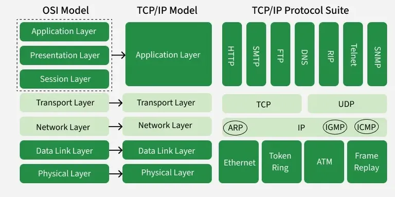<br><i>figure 1.9: Reference Models: OSI and TCP/IP</i></p>

| OSI Model                                                                                 | TCP/IP Model                                                                |
| :---------------------------------------------------------------------------------------- | :-------------------------------------------------------------------------- |
| **7 layers:** Physical, Data Link, Network, Transport, Session, Presentation, Application | **5 layers:** Physical, Data Link, Network/Internet, Transport, Application |
| Separate Session layer manages connections/synchronization                                | No separate Session layer; handled in Application layer                     |
| Presentation layer handles data formatting/encryption                                     | Data formatting/encryption done within Application layer                    |
| Theoretical model developed by ISO for standardization                                    | Practical model developed by DoD for Internet use                           |
| Each layer strictly independent with clear interfaces                                     | Layers more integrated, less strict boundaries                              |
| No specific protocols defined, just functions                                             | Defines specific protocols: TCP, UDP, IP, HTTP, etc.                        |
| Used as reference for teaching/network design                                             | Actual protocol stack used by Internet globally                             |
| Developed before widespread Internet use                                                  | Developed specifically for ARPANET/Internet implementation                  |

#### 1.10. End-to-end Communication

End-to-end (E2E) communication is a networking principle where data is transmitted directly from the source to the destination without intervention from intermediate nodes.

- End-to-end connectivity ensures a seamless, uninterrupted connection often using acknowledgement messages (ACK) to confirm data receipt.

- This approach places responsibility for functionality (reliability, security) at the network's endpoints rather than in the core.

- **Example:** An arbitrarily reliable file transfer between two endpoints in a distributed network.

- **Limitation:** The most important limitation of the end-to-end principle is that its basic premise, place functions in the application endpoints rather than in the intermediary node, which is hard to implement properly.

---

#### 1.11. End-to-End Throughput

End-to-end throughput is the total rate of successful data transfer (bits/second) from source to destination across a network path, typically determined by the bottleneck link along that path.

<pre>
Throughput = min(<i>R<sub>1</sub></i>, <i>R<sub>2</sub></i>, ..., <i>R<sub>n</sub></i>)
</pre>

- When _**N**_ connections share a link (**R**), the throughput per connection is **R / N**.

- **Instantaneous throughput** measures the rate at a specific moment, while **average throughput** calculates it over a sustained period.

- **Example:** The lower of the server's upload speed or the client's download speed often acts as the bottleneck (end-to-end throughput)

<ins><strong>Factors affecting throughput:</strong></ins>

- **Wireless Interference:** Hidden nodes and simultaneous transmissions.
- **Protocol Overhead:** TCP/IP headers and acknowledgments.
- **Network Congestion:** High traffic load can lead to packet loss and retransmissions.

---

#### 1.12. Why do packet loss and delay occur?

- **Network Congestion:** During peak hours, data traffic exceeds network capacity, leading to queuing delays and dropped packets.

- **Hardware/Software Issues:** Outdated firmware, overheated routers, or faulty cables can fail to process packets, causing them to be lost or delayed.

- **Wireless Signal Interference:** Physical obstructions or electromagnetic interference can corrupt data packets in Wi-Fi, resulting in packet loss.

- **Buffer Overflows:** When a network device receives more data than its memory buffer can hold, it drops incoming packets.

- **Routing/Configuration Errors:** Misconfigured network devices can cause packets to loop or be dropped.

#### 2.1. Client-Server Model

The client-server model is a distributed application structure where a client (_e.g., a web browser_) sends requests for data or services to a server (_e.g., a web server_), which processes them and returns a response.

**Server:**

- Always-on host
- Has apermanent IP address
- Often used in data centers for scaling capabilities

**Clients:**

- Contact, communicate with server
- Maybe intermittently connected
- May have dynamic IP addresses
- Do not communicate directly with each other

Example protocols that establishes a client-server model: **HTTP**, **IMAP**, **FTP**.

---

#### 2.2. Peer-to-Peer Model

A peer-to-peer (**P2P**) model is a decentralized network architecture where individual computers, or "peers," act as both clients and servers, directly sharing resources like files, processing power, or storage without a central authority.

- There is NO always-on server.
- Arbitrary end systems directly communicate with each other.
- Peers request service from other peers, providing service in return to other peers.
- **Self scalability:** new peers bring new service capacity, as well as new service demands.
- Peers are intermittently connected and change IP addresses.
- **Example:** P2P file sharing.

---

#### 2.3. Sockets

A network socket is the software-defined, bidirectional endpoint of a communication link between two programs running on a network. **Sockets are essential for client-server communication, enabling processes to exchange data over protocols like TCP or UDP.**

<p align="center"><br><i>figure 2.3: Sockets in Networking</i></p>

<ins><strong>Types:</strong></ins>

- **Stream Sockets (TCP):** Provide reliable, ordered, and error-checked delivery of data, commonly used for HTTP, web browsing, and email.

- **Datagram Sockets (UDP):** Offer faster, connectionless, but unreliable delivery, ideal for streaming or online gaming.

<ins><strong>Working Principle:</strong></ins>

1. **Server Side:** The server creates a socket, binds it to a specific port, and listens for incoming connections.

2. **Client Side**: The client creates its own socket and initiates a connection to the server's IP and port.

3. **Communication:** Once connected, both sides use the socket to read/write data, similar to operating on a file.

4. **Termination:** The socket connection is closed when the communication is finished, freeing up the resources.

---

#### 2.4. IP Addressing Method

IP addressing is a method of assigning unique numerical labels to devices for identification on a network.

**Core Types:**

- **IPv4:** Uses a 32-bit address, written in dotted-decimal format.
- **IPv6:** Uses a 128-bit address written in hexadecimal.

**Static vs. Dynamic Addressing:**

- **Static IP:** Manually assigned, permanent, and often used for servers.
- **Dynamic IP:** Automatically assigned by a DHCP server, common for end-user devices.

**Public vs. Private IP Addresses:**

- **Public IP:** Routable on the internet, assigned by an ISP.
- **Private IP:** Used within local networks (e.g., home/office) and not directly accessible from the internet.

**Classful and Classless Addressing:**

- **Classful Addressing:** Divides IPv4 addresses into classes (**A-E**) based on the first octet.
- **Classless Inter-Domain Routing (CIDR):** Replaced classful addressing to improve efficiency by allowing flexible network sizing using a subnet mask or prefix length (_e.g., /27_)

**Special Purpose IP Addresses:**

- **Loopback Address (127.0.0.1)**: Used by a computer to test its own network interface.
- **Default Gateway (0.0.0.0)**: Represents an unknown or default network target.
- **Automatic Private IP Addressing (APIPA)**: Assigned automatically (_169.254.0.1_ to _169.254.254.254_) if DHCP fails.

---

#### 2.5A. Web (HTTP) Protocol

The Hypertext Transfer Protocol (**HTTP**) is an application-layer protocol designed for transmitting hypermedia documents, such as HTML, acting as the foundation of data exchange on the World Wide Web.

- **Protocol Function:** It facilitates the loading of web pages, images, videos, and scripts, often utilizing **port 80**.

- **Request-Response Cycle:** A client sends a request (_e.g., GET_) to a server, which processes it and sends back a response, including a status code (_e.g., 200 OK_).

- **Stateless Nature:** HTTP is stateless, meaning the server does not retain information about the client between requests.

- **Components of HTTP:**
    - **Requests:** Contain methods (GET, POST), URI, HTTP version, headers, and body.
    - **Responses:** Include a status line (version, status code, message), headers, and the entity body.
    - **Methods:** Common methods include,
        - GET (retrieve data),
        - POST (submit data),
        - PUT (update data), and
        - DELETE (remove data)

#### 2.5B. HTTP Connection Types

Mainly two types:

1. **Persistent HTTP (HTTP/1.1+):** The connection remains open, waiting for more data, which saves time.

2. **Non-persistent HTTP (HTTP/1.0):** The connection closes immediately after the object is received, which may require parallel connections to be efficient.

| Feature      | Persistent (Keep-Alive)    | Non-persistent          |
| :----------- | :------------------------- | :---------------------- |
| Connections  | 1 TCP for multiple objects | 1 TCP per object        |
| Handshake    | Once for all requests      | Every request           |
| Latency      | Low (1 RTT for multiple)   | High (2 RTT per object) |
| HTTP Version | Default in 1.1+            | Primarily 1.0           |
| Efficiency   | High, low overhead         | Low, high overhead      |

#### 2.5C. HTTP Request Methods

The most common HTTP methods, often mapping to **CRUD** (Create, Read, Update, Delete) operations, are:

- `GET`

    Retrieves a representation of the specified resource. `GET` requests should only be used for reading data and are considered _safe_ meaning they do not modify the server's state. **Idempotent** and **Cacheable**.

- `POST`

    Submits data to be processed to a specified resource, typically resulting in the creation of a new resource. **Non-idempotent** meaning **repeating an identical POST request may create duplicate resources**.

- `PUT`

    Replaces all current representations of the target resource with the content provided in the request body. If the resource does not exist, the server may create it. **Idempotent**, **ensuring that multiple identical requests result in the same server state**.

- `PATCH`

    Applies partial modifications to a resource. This method is more efficient than PUT for minor updates as it only sends the data that needs to be changed, not the entire resource representation. **Not necessarily idempotent**.

- `DELETE`

    Removes the specified resource. This method is also **idempotent**, **as the resource will remain deleted even if the request is repeated**.

| Method   | Feature                          |
| :------- | :------------------------------- |
| `GET`    | **Idempotent** and **Cacheable** |
| `POST`   | **Non-idempotent**               |
| `PUT`    | **Idempotent**                   |
| `PATCH`  | **Not necessarily idempotent**   |
| `DELETE` | **Idempotent**                   |

> _An HTTP method is **idempotent** if the intended effect on the server of making a single request is the same as the effect of making several identical requests._

#### 2.5D. HTTP Response Codes

HTTP response status codes are three-digit numbers sent by a server to indicate the status of a client's request. These codes are grouped into **five categories** based on their first digit:

- **1XX**: Informational
- **2XX**: Success
- **3XX**: Redirection
- **4XX**: Client Error
- **5XX**: Server Error

**Common HTTP Response Codes:**

- **200 OK:** request succeeded, requested object later in this message.
- **301 Moved Permanently:** requested object moved, new location specified in the `location` field.
- **400 Bad Request:** request message was not understood by the server.
- **404 Not Found:** requested document not found on this server.
- **505 HTTP Version Not Supported**

---

#### 2.6A. Cookies

An HTTP cookie is a **small text file** sent by a web server to a user's browser, enabling websites to store stateful information (like login status or shopping cart items) on the client-side, **overcoming HTTP's native statelessness**. Cookies are used for session management, personalization, and tracking, typically stored for a set duration.

Cookies are generally limited to **4KB in size**.

#### 2.6B. Components of Cookies

- **Name-Value Pair:** The core data, identifying the cookie (_e.g., session_id=abc123_).
- **Domain:** Specifies which hosts can receive the cookie.
- **Path:** Restricts the cookie to specific URL paths (e.g., /app).
- **Expires/Max-Age:** Determines the lifetime. Without these, it is a session cookie deleted upon closing the browser.
- **Secure:** Ensures the cookie is sent only over HTTPS.
- **HttpOnly:** Prevents client-side scripts (JavaScript) from accessing the cookie.
- **SameSite:** Mitigates CSRF attacks by controlling if cookies are sent with cross-site requests (values: **Lax, Strict, None**)
- **Partition Key:** Used for modern, partitioned cookies (CHIPS)

#### 2.6C. Cookie Mechanism

<p align="center">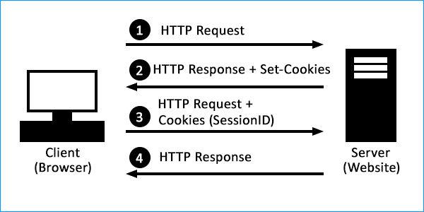<br><i>figure 2.6C: Cookie Mechanism</i></p>

1. The server sends a `Set-Cookie` header in the HTTP response.
2. The browser saves the cookie.
3. For subsequent requests to the same domain, the browser sends the cookie back in the `Cookie` header.

---

#### 2.7A. Web Caching

A web cache is a technology that temporarily stores copies of website data, such as HTML, images, and JavaScript, closer to the user to accelerate page loading speeds, reduce server load, and minimize bandwidth usage.

- By storing frequently accessed content, it eliminates the need to fetch data from the original server repeatedly.

- Common types of web cache include browser, proxy, and CDN caches, all designed to make the web faster.

#### 2.7B. Web Caching with Proxy Servers

A web cache proxy server is an intermediary server that stores copies of frequently accessed web content (like images, documents, and web pages) to fulfill future requests faster.

When a user requests a website, the proxy checks if it has a stored copy. If yes, it serves the cached data instantly. If not, it fetches the data from the origin server, saves a copy for future use, and passes it to the user.

<p align="center">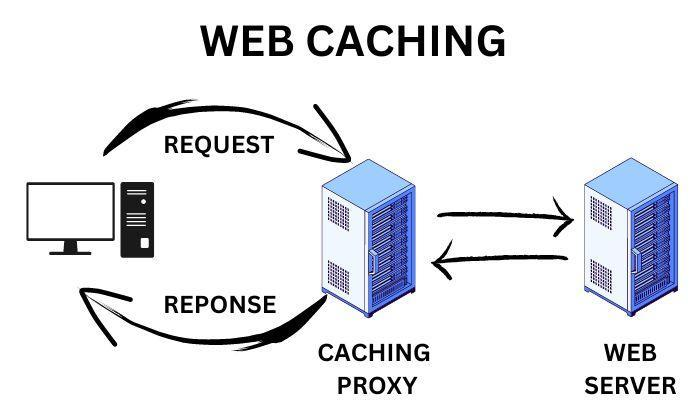<br><i>figure 2.7B: Web Caching with Proxy Servers</i></p>

**Types of Proxy Caching:**

- **Forward Proxy Cache:** Sits in front of clients, often in a LAN, to cache internet content for users.
- **Reverse Proxy Cache (CDN):** Sits in front of a web server to store static content, reducing load on the origin server and speeding up content delivery to users.

#### 2.7C. Web Caching Example

<ins><strong>Scenario:</strong></ins>

- Access Link Rate: **1.54 Mbps**
- RTT from router to server: **2.01 sec**
- Web object size: **100 Kb**
- Average request rate from browsers to origin servers: **15 per sec**
- Average data rate to browsers: **1.50 Mbps**

<ins><strong>Performance:</strong></ins>

Suppose cache hit rate is **0.4**.

- 40% requests served by cache, with low delay,
- 60% requests satisfied at origin.

```
Data rate to browsers over access link,
        0.6 * 1.50 Mbps = 0.9 Mbps

Access link utilization,
        0.9 / 1.54 = .58 (low queueing delay)

Average end-to-end delay:
        0.6 * (delay from origin servers) +
        0.4 * (delay when satisfied at cache)
    =   0.6 (2.01) + 0.4
    ~   1.2 sec
```

---

#### 2.8. Conditional GET

**A conditional GET** is an HTTP request mechanism that allows a client (like a web browser or proxy server) to ask the server if a cached resource has changed since it was last retrieved.

<ins><strong>Working Principle:</strong></ins>

1. **Initial Request**
    - The client makes a standard `GET` request for a resource.
    - The server responds with the resource, client stores the resource body and these headers in its cache.

2. **Conditional Request**
    - When the resource is requested again and the cached version is considered "stale", the client issues a new `GET` request that includes a conditional header field using the previously stored validator values.

3. **Server Response**
    - The server checks the condition(s) provided in the request headers against the resource's current state on the server.

    - **If the resource has not changed:** The server tells the client to use its local cached copy, saving bandwidth (**304 Not Modified**)

    - **If the resource has changed:** The server responds with a **200 OK** status code and the full, new resource body, and new validator headers to be used for future conditional requests.

<ins><strong>Benefits:</strong></ins>

1. Saves bandwidth,
2. Reduces latency and server load,
3. Allows caches to efficiently validate their stored content.

---

#### 2.9. Mitigating HOL Blocking (HTTP/2)

Head-of-Line (**HOL**) blocking is a networking performance bottleneck where the first packet (or request) in a queue stalls all subsequent packets, even if those later packets are destined for idle resources.

<p align="center">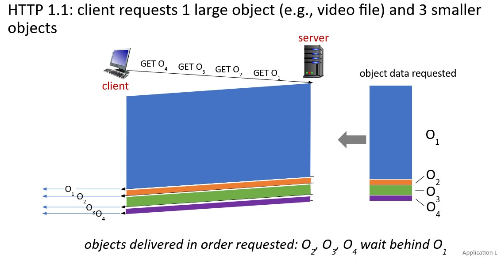<br><i>figure 2.9.1: HOL Blocking in HTTP 1.1</i></p>

- **HTTP/2 multiplexing** enables sending multiple requests and responses in parallel over a single connection, allowing independent handling of resources.

- HTTP/2 breaks down messages into independent, numbered frames (**streams**), allowing them to be interleaved and reassembled efficiently.

- HTTP/2 Allows the client to tell the server which resources are more important, ensuring critical data is sent first even within a multiplexed connection.

<p align="center">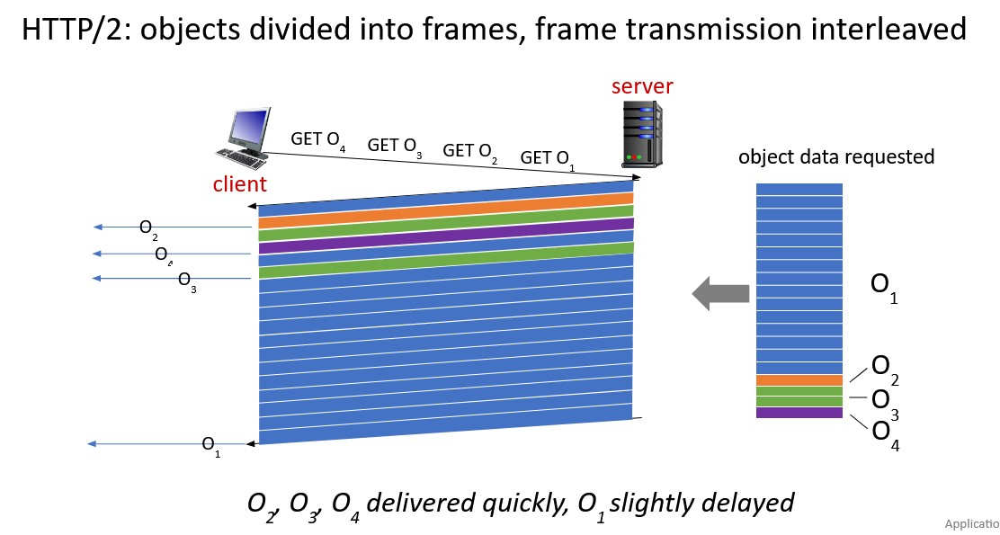<br><i>figure 2.9.2: Mitigating HOL Blocking in HTTP/2</i></p>

- **Limitation:** Since **HTTP/2 runs over TCP**, if a single TCP packet is lost, all streams within that connection are stalled until the packet is retransmitted. This is particularly noticeable in high-latency or unstable networks.

---

#### 2.10. SMTP and its Components

Simple Mail Transfer Protocol (**SMTP**) is the industry-standard protocol for sending and relaying outgoing emails across networks, acting as the internet's digital post office.

<p align="center">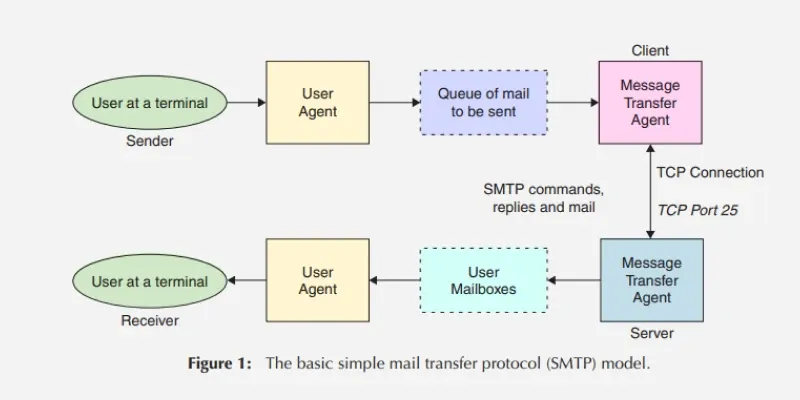<br><i>figure 2.10: SMTP Model</i></p>

<ins><strong>Working Principle:</strong></ins>

- **Client to Server:** Client sends the message to the email provider's server (SMTP server).

- **Server to Server (Relay):** The SMTP server locates the recipient's mail server and transfers the message.

- **Delivery:** The recipient's mail server receives the message and stores it, often requiring **IMAP/POP3** for retrieval.

<ins><strong>Components:</strong></ins>

- **Mail User Agent (MUA):** It is a computer application that helps you in sending and retrieving mail. It is responsible for creating email messages for transfer to the mail transfer agent (MTA).
- **Mail Submission Agent (MSA):** It is a computer program that receives mail from a Mail User Agent (MUA) and interacts with the Mail Transfer Agent (MTA) for the transfer of the mail.
- **Mail Transfer Agent (MTA):** It is software that has the work to transfer mail from one system to another with the help of SMTP.
- **Mail Delivery Agent (MDA):** A mail Delivery agent or Local Delivery Agent is basically a system that helps in the delivery of mail to the local system.

<ins><strong>Core Operations:</strong></ins>

- **Connection:** The client establishes a TCP connection.
- **HELO/EHLO:** It initiates the session by identifying itself with **HELO (basic)** or **EHLO (extended)**.
- **MAIL FROM:** Initiates the transaction and specifies the sender's email address (envelope sender).
- **RCPT TO:** Identifies the recipient's email address. This command can be issued multiple times for multiple recipients.
- **DATA:** Signals the start of the message content (header and body). The client sends the content, ending with a single period (.) on a line.
- **QUIT:** Terminates the SMTP session.

<ins><strong>SMTP vs HTTP:</strong></ins>

| Feature             | SMTP            | HTTP                             |
| :------------------ | :-------------- | :------------------------------- |
| **Purpose**         | Sending Email   | Transferring Web Data            |
| **Push/Pull**       | Push            | Pull                             |
| **Default Port(s)** | 25, 587, or 465 | 80 or 443                        |
| **Encoding**        | 7-bit ASCII     | No specific encoding restriction |
| **Connection**      | Persistent      | Persistent or Non-persistent     |

---

#### 2.11. IMAP and POP3

Internet Message Access Protocol (IMAP) is a standard, widely used email protocol (operating on port 143 or 993 for SSL) that allows users to access and synchronize emails across multiple devices.

> _Unlike POP3, **IMAP leaves messages on the server**, ensuring that actions like reading or deleting are reflected everywhere._

<ins><strong>IMAP vs POP3:</strong></ins>

| IMAP                                                                                                                                          | POP3                                                                                          |
| :-------------------------------------------------------------------------------------------------------------------------------------------- | :-------------------------------------------------------------------------------------------- |
| Users can access their emails from any device.                                                                                                | By default, emails can only be accessed from the device they are downloaded on.               |
| The server stores emails; IMAP acts as an intermediary between the server and the client.                                                     | Once downloaded, emails are deleted from the server, unless otherwise configured.             |
| Emails are not accessible offline.                                                                                                            | Emails are accessible offline but only on the device they were downloaded on.                 |
| The bodies of emails are not downloaded until a user clicks on them, but subject lines and sender names populate quickly in the email client. | Emails are downloaded to the device by default, so messages may take longer to load.          |
| IMAP requires more server space because emails are not automatically deleted from the server.                                                 | POP3 conserves email server storage because emails are automatically deleted from the server. |

---

#### 2.12. DNS: Services and Structure

Domain Name System (**DNS**) is a hierarchical, distributed database that translates human-readable domain names into numerical IP addresses, enabling web browsing and service mapping.

<ins><strong>Services/Features:</strong></ins>

- **Name Resolution:** Translates domain names into IP addresses, making it easier for users to locate websites and resources.

- **Caching:** Stores previous query results to speed up subsequent requests and reduce load on authoritative servers.

- **Load Balancing:** Distributes traffic across multiple servers to enhance performance and availability.

- **Reverse Resolution:** Maps an IP address back to its corresponding domain name.

- **Dynamic Updates:** Allows for automatic registration and updates of DNS records.

- **Mail Server Aliasing**

<ins><strong>Structure:</strong></ins>

DNS is hierarchical primarily to enable scalability, distributed management, and efficiency for the internet's massive, growing infrastructure.

<p align="center">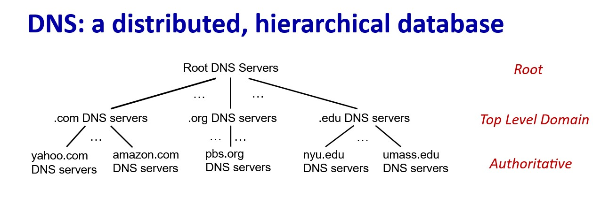<br><i>figure 2.12: DNS Structure</i></p>

By using a tree-like structure (root, TLDs, authoritative servers), no single server needs to store all domain records, preventing bottlenecks and allowing decentralized administration of domain names.

---

#### 2.13. TLD and Authoritative DNS

**Top-Level Domain (TLD):** A top-level domain (**TLD**) is the final segment of a domain name (e.g., '.com' in 'google.com'), representing the highest level in the hierarchical
Domain Name System (DNS). TLDs categorize websites by purpose (.com, .org, .edu) or geographic location (.uk, .jp, .de). TLDs are essential for navigating the internet by directing browser requests to specific IP addresses.

**Authoritative DNS:** An authoritative DNS server is the final, trusted source of truth that holds the actual DNS records (**A, MX, CNAME, etc.**) for a specific domain, translating human-readable domain names into IP addresses. When a user enters a URL, the recursive resolver (managed by an ISP or service like `8.8.8.8`) queries the authoritative server to get the final IP address.

---

#### 2.14. Iterated & Recursive Queries

| Feature            | Recursive                                                                                                                                                  | Iterative                                                                                                          |
| :----------------- | :--------------------------------------------------------------------------------------------------------------------------------------------------------- | :----------------------------------------------------------------------------------------------------------------- |
| Who does the work? | The DNS resolver performs all follow-up queries on behalf of the client.                                                                                   | The client (or the local resolver acting as a client) performs each subsequent query itself, following referrals.  |
| Response Type      | Returns the final, complete answer (the IP address) or an error message.                                                                                   | Returns the best information it has (either the answer or a referral to another DNS server).                       |
| Typical Use        | Used between a client device (e.g., your computer or browser) and its designated recursive DNS resolver (like your ISP's or Google Public DNS at 8.8.8.8). | Used between the recursive DNS resolver and other DNS servers in the hierarchy (root, TLD, authoritative servers). |
| Complexity         | Simple for the client, which makes one request and waits for the final result.                                                                             | More complex for the client, which must manage the step-by-step process of querying multiple servers.              |

---

#### 2.15. DNS Records: Components

DNS records are instructions within a DNS zone file that map domain names to IP addresses or other resources.

<p align="center">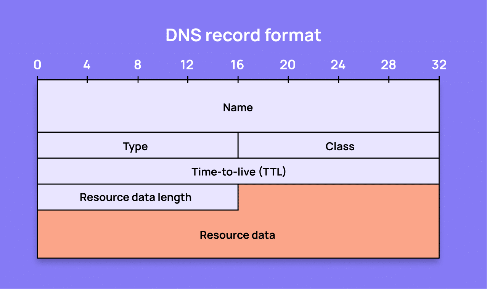<br><i>figure 2.15: DNS Record Format</i></p>

<ins><strong>Key Components of a DNS Record:</strong></ins>

- **Name (Host/Label):** The domain name or subdomain the record applies to (_e.g., www or @ for the root domain_).
- **Type:** The specific type of record (_e.g., A, AAAA, CNAME, MX, NS, TXT_).
- **Value (Target/Data):** The information the record provides, such as an IP address, a mail server (mail.example.com), or a text string.
- **TTL (Time to Live):** The duration in seconds that DNS resolvers should cache the record before checking for updates.
- **Class:** Almost always "IN" for Internet, indicating an IP address.

<ins><strong>Common DNS Record Types:</strong></ins>

- **A/AAAA:** Maps a hostname to an IPv4 (A) or IPv6 (AAAA) address.
- **CNAME:** Points a domain or subdomain to another hostname (alias)
- **MX:** Routes email to the correct mail server.
- **NS:** Delegates a DNS zone to use specific authoritative name servers.
- **TXT:** Allows associating arbitrary text with a host, often used for security (SPF, DKIM) or verification.
- **SOA (Start of Authority):** Contains crucial information about the DNS zone, such as the primary nameserver, contact email, and refresh rates.
- **PTR (Pointer):** Used in reverse DNS lookups to map an IP address to a hostname.

---

#### 2.16. FTP

The File Transfer Protocol (**FTP**) is a standard communication protocol used for the transfer of computer files from a server to a client on a computer network.

- FTP is built on a client–server model architecture using separate control and data connections between the client and the server.

- FTP is considered **insecure**, as data and credentials are sent in clear text. Modern alternatives include SFTP or FTPS.

- Files can be transferred in **ASCII** (text) or **Binary mode** (executable files, images).

<p align="center">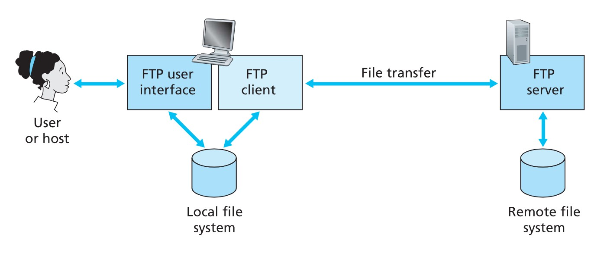<br><i>figure 2.16.1: FTP moves files between local and remote file systems</i></p>

<ins><strong>Working Principle:</strong></ins>

<p align="center">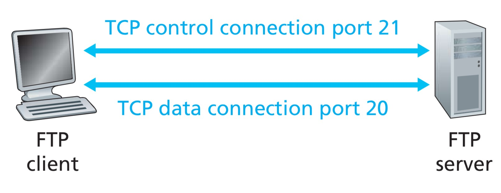<br><i>figure 2.16.2: FTP working principle</i></p>

- **Client-Server Model:** An FTP client (_e.g., FileZilla_) connects to an FTP server, requesting access via user credentials or anonymously.

- **Two-Channel Architecture:**
    - **Control Connection (Port 21):** Stays open throughout the session to handle commands (e.g., login, file navigation) and responses.

    - **Data Connection (Port 20 or dynamic):** Opens only when a file is transferred and closes immediately after.

- **Transfer Modes:**
    - **Active Mode:** The client tells the server which port to connect to; the server initiates the data connection from its port 20.

    - **Passive Mode (PASV):** The server tells the client which port to connect to; the client initiates the data connection, which is better for navigating firewalls.

<ins><strong>Components:</strong></ins>

- FTP Client
- FTP Server
- Control Connection (Persistent)
- Data Connection (Temporary)
- Authentication Mechanism

<ins><strong>Commands:</strong></ins>

- USER username
- PASS password
- LIST
- RETR filename (`GET`)
- STOR filename (`PUT`)

<ins><strong>Common Responses:</strong></ins>

```
331 Username OK, password required
125 Data connection already open; transfer starting
425 Can't open data connection
452 Error writing file
```

---

#### 2.17. IP Addressing

> _An IP address is a logical numerical identifier assigned to a device in a network. It allows devices to locate and communicate with each other._

IPv4 addresses use 32 bits and are written in dotted decimal notation.

<p align="center">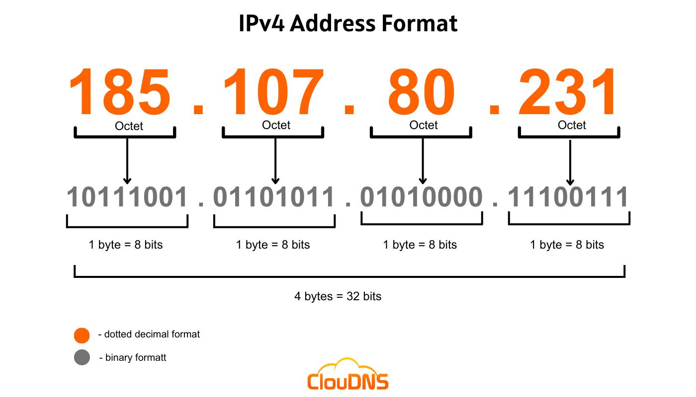<br><i>figure 2.17: IPv4 Addressing Format</i></p>

```
Example: 192.168.1.1
Each octet ranges from 0 to 255.
```

IPv4 addresses are divided into classes. Each class has a **default subnet mask**.

- Class A (**1–126**),
- Class B (**128–191**),
- Class C (**192–223**)

| Class | First Octet Range | Default Subnet Mask                   | Purpose               |
| :---- | :---------------- | :------------------------------------ | :-------------------- |
| A     | 0 – 127           | 255.0.0.0 (network bits: **/8**)      | Large networks        |
| B     | 128 – 191         | 255.255.0.0 (network bits: **/16**)   | Medium networks       |
| C     | 192 – 223         | 255.255.255.0 (network bits: **/24**) | Small networks        |
| D     | 224 – 239         | N/A                                   | Multicast             |
| E     | 240 – 255         | N/A                                   | Experimental/Research |

- **Subnet Mask:** A subnet mask determines the network and host portion of an IP address. It helps devices identify whether another device is on the same network.

- **Default Gateway:** The default gateway is the router interface IP address. It allows devices to send data outside their local network.

- **Subnetting:** Subnetting is the process of dividing a large IP network into smaller logical networks called subnets. Each subnet allows devices to communicate efficiently, improving network performance, security, and manageability.

---

#### 2.18. Cryptographic Components

Cryptography is the science of protecting information by transforming it into an unreadable form so that only authorized parties can understand it.

**The basic principles are:**

- **Confidentiality:** Ensures that information is accessible only to authorized users (achieved using encryption)

- **Integrity:** Ensures that data is not altered during transmission or storage.

- **Authentication:** Verifies the identity of the sender and receiver of information.

- **Non-repudiation:** Prevents a sender from denying that they sent a message.

**Casear Ciphers:**

The action of a Caesar cipher is to replace each plaintext letter with a different one a fixed number of places down the alphabet.

- **Poly-alphabetic Cipher:** A poly-alphabetic cipher uses multiple substitution alphabets. Each character is encrypted using a different Caesar cipher key, based on a repeating pattern.

- **Mono-alphabetic Cipher:** A monoalphabetic cipher is a substitution technique where each character of plaintext is consistently mapped to a single, fixed ciphertext character throughout the entire message.

---

#### 3.1. TCP vs UDP

**Transmission Control Protocol (TCP):** A reliable, connection-oriented transport protocol that ensures accurate and ordered data delivery. It uses control mechanisms to guarantee data correctness, which makes it slower but dependable.

**User Datagram Protocol (UDP):** A fast, connectionless transport protocol that sends data without reliability guarantees. It is efficient for applications where speed is more important than accuracy.

| TCP                                             | UDP                                    |
| :---------------------------------------------- | :------------------------------------- |
| Connection-oriented; uses a three-way handshake | Connectionless; no handshake           |
| Guarantees reliable data delivery               | Does not guarantee delivery            |
| Uses acknowledgements (ACKs)                    | No acknowledgements                    |
| Supports retransmission of lost packets         | No retransmission support              |
| Ensures packets are delivered in order          | Does not ensure ordering               |
| Provides flow control and congestion control    | No flow or congestion control          |
| Slower due to higher overhead                   | Faster with minimal overhead           |
| Variable header size                            | Fixed header size                      |
| Treats data as a continuous byte stream         | Treats data as independent messages    |
| Does NOT support broadcasting or multicasting   | Supports broadcasting and multicasting |
| Used by HTTP, HTTPS, FTP, SMTP                  | Used by DNS, DHCP, VoIP, Streaming     |

#### 3.2. UDP Segment Headers

A UDP segment consists of a minimal **8-byte header** followed by the application payload data.

<p align="center">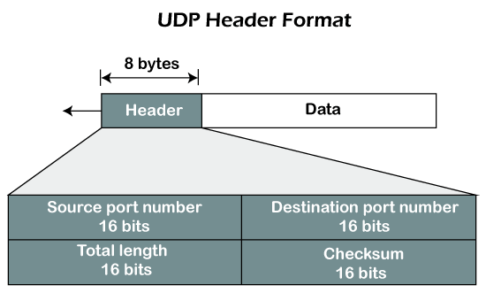<br><i>figure 3.2: UDP Segment Headers</i></p>

<ins><strong>UDP Segment Header Structure:</strong></ins>

- **Source Port (16 bits):** Identifies the sending application's port number. It can be set to zero if the destination does not need to reply.

- **Destination Port (16 bits):** Identifies the receiving application's port number on the destination host.

- **Length (16 bits):** Specifies the total length in bytes of the UDP header and payload data combined. The minimum value is 8 bytes.

- **Checksum (16 bits):** Used for error checking to verify header and payload integrity. It is optional in IPv4 but required in IPv6.

- **Data (Variable Length):** The actual payload, such as audio/video samples or DNS queries.

#### 3.3. TCP Segement Structure

A TCP segment consists of a **20–60 byte header** followed by application data.

<p align="center">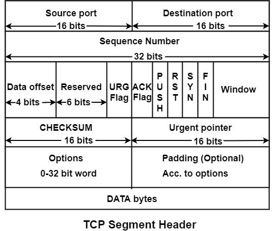<br><i>figure 3.3: TCP Segment Headers</i></p>

<ins><strong>TCP Segment Header Structure:</strong></ins>

- **Source Port (16 bits):** Identifies the sending application.

- **Destination Port (16 bits):** Identifies the receiving application.

- **Sequence Number (32 bits):** Byte number of the first byte in this segment, used for reassembling segments in order.

- **Acknowledgment Number (32 bits):** Next byte expected by the receiver; valid only if ACK flag is set.

- **Data Offset/Header Length (4 bits):** Indicates where data begins (size of header, 20-60 bytes).

- **Control Flags (6 bits/1 bit each)**:
    - **URG:** Urgent pointer field is significant.
    - **ACK:** Acknowledgment field is significant.
    - **PSH:** Push function; receiver should pass data to application immediately.
    - **RST:** Reset the connection.
    - **SYN:** Synchronize sequence numbers (used in connection setup).
    - **FIN:** No more data from sender (used in connection termination).

- **Window Size (16 bits):** Used for flow control, indicating the number of bytes the receiver is willing to accept.

- **Checksum (16 bits):** Used for error detection of the header and data.

- **Urgent Pointer (16 bits):** Points to the end of urgent data if URG flag is set.

- **Options (0-40 bytes):** Optional header information, such as Maximum Segment Size (MSS)

<ins><strong>TCP Segment Components:</strong></ins>

- **Header:** 20 bytes **(mandatory)** up to 60 bytes **(with options)**.
- **Payload (Data):** The actual application data being transferred.

---

#### 4.1. IPv4 Packet Structure

An IPv4 packet consists of a **20-60 byte header** followed by a variable-length data payload.

<p align="center">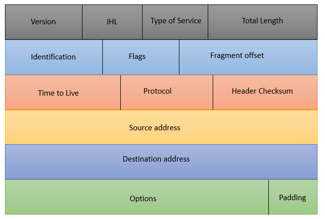<br><i>figure 4.1: IPv4 Packet Structure</i></p>

- **Version (4 bits):** Indicates the IP version, set to 4 for IPv4.
- **Internet Header Length (IHL) (4 bits):** Specifies the header size in 32-bit words; typically 5 (20 bytes).
- **Type of Service/DSCP (8 bits):** Used for traffic prioritization and quality of service.
- **Total Length (16 bits):** Entire packet size (header + payload) in bytes, up to 65,535 bytes.
- **Identification (16 bits):** Used to identify fragments of a single IP datagram.
- **Flags (3 bits):** Controls fragmentation (e.g., Don't Fragment, More Fragments).
- **Fragment Offset (13 bits):** Indicates the position of a fragment in the original packet.
- **Time to Live (TTL) (8 bits):** Prevents routing loops by decrementing at each hop; packet dies at 0.
- **Protocol (8 bits):** Identifies the upper-layer protocol (e.g., TCP=6, UDP=17).
- **Header Checksum (16 bits):** Validates the integrity of the header.
- **Source IP Address (32 bits):** The IPv4 address of the sender.
- **Destination IP Address (32 bits):** The IPv4 address of the receiver.
- **Options (Optional, 0-40 bytes):** Rarely used fields for network testing or security.

---

#### 4.2. IPv6 Packet Structure

An IPv6 packet consists of a mandatory **40-byte (320-bit) fixed header**, optional extension headers, and the upper-layer payload (e.g., TCP/UDP).

<p align="center">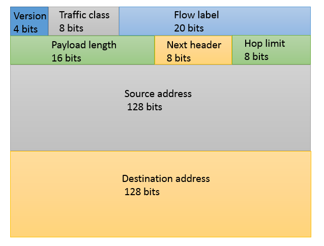<br><i>figure 4.2: IPv6 Packet Structure</i></p>

- **Version (4 bits):** Set to 6 to indicate IPv6.
- **Traffic Class (8 bits):** Used for QoS, similar to IPv4's Type of Service (ToS) field.
- **Flow Label (20 bits):** Identifies specific traffic flows to assist routers in handling packets.
- **Payload Length (16 bits):** Length of the payload in bytes (excluding the 40-byte header)
- **Next Header (8 bits):** Identifies the type of header immediately following the IPv6 header (e.g., TCP, UDP, or an extension header)
- **Hop Limit (8 bits):** Decremented by 1 at each router; if it reaches 0, the packet is discarded (_replaces IPv4 TTL_)
- **Source Address (128 bits):** The IPv6 address of the originator.
- **Destination Address (128 bits):** The IPv6 address of the recipient.

---

#### 4.3. What happens when TTL is zero?

When the Time to Live (**TTL**) value of an IP packet reaches zero, the router currently handling the packet discards it to prevent it from looping endlessly in the network. After discarding the packet, the router typically sends an ICMP `"Time Exceeded"` message back to the original sender to notify them of the packet expiration.

Essentially, a TTL of zero acts as a safety mechanism to ensure network health by destroying "lost" or stuck data packets.

---

#### 4.4. What is a fragment?

A fragment in networking is a smaller piece of a larger data packet, created when the original packet exceeds the
Maximum Transmission Unit (MTU) of a network link. Routers or sending devices break packets into fragments to pass through networks with smaller size limitations. Each fragment contains a portion of the original data, a header, and an offset to allow for reassembly at the destination.

> _Sending a 2000-byte IP packet over an Ethernet network with a 1500-byte MTU requires fragmentation._

---

#### 4.5. IPv6 Flow Label

The IPv6 Flow Label is a 20-bit field in the IPv6 header (defined in **RFC 6437**) used to tag sequences of packets, such as voice calls or video streams, that require special handling, like specific Quality of Service (QoS) or path routing.

It allows routers to efficiently classify and process traffic flows without examining higher-layer headers.

<p align="center">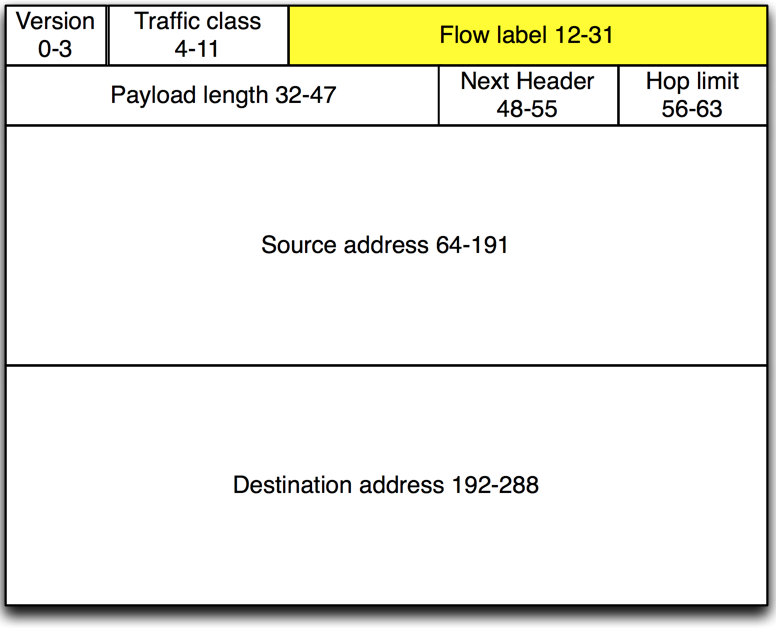<br><i>figure 4.5: IPv6 Flow Label</i></p>

#### 4.6A. TCP Congestion Control: AIMD

TCP Congestion Control using Additive Increase/Multiplicative Decrease (**AIMD**) is a feedback mechanism where the congestion window (_cwnd_) increases linearly by one Maximum Segment Size (**MSS**) per Round Trip Time (**RTT**) in the absence of congestion, and is reduced by half (0.5 × _cwnd_) upon detecting packet loss.

<p align="center">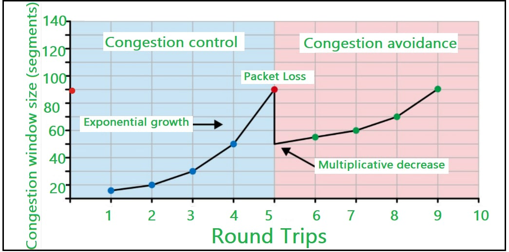<br><i>figure 4.6: TCP Congestion Control using AIMD</i></p>

This "sawtooth" pattern allows TCP to probe for bandwidth, quickly scale back to avoid network collapse, and ensure fairness among multiple flows.

#### 4.6B. Why is AIMD used?

- **Congestion Control:** It prevents the network from becoming overloaded by reducing the sending rate (often halving the congestion window) when packet loss is detected.
- **Fairness and Stability:** Multiple network flows using AIMD will converge to a stable, shared usage of the available bandwidth, promoting fairness.
- **Efficiency:** By slowly increasing the rate, it probes for available bandwidth, maximizing network utilization.
- **Robustness:** It is a decentralized, adaptive mechanism that works well in dynamic, changing network environments.

---

#### 4.7. TCP Slow Start

TCP Slow Start is a foundational TCP congestion control algorithm that prevents network overload by starting data transmission with a small congestion window (_cwnd_) and increasing it exponentially for every received ACK.

<p align="center">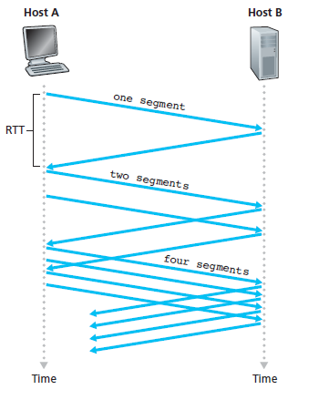<br><i>figure 4.7: TCP Slow Start</i></p>

---

### Mathematical Questions

#### 6. Internet Checksum

To calculate the Internet checksum, treat the data as a sequence of **16-bit integers**, sum them using 16-bit one's complement arithmetic (adding carries back to the LSB), and take the one's complement of the result.

**Steps:**

- **Divide Data into 16-bit Words:** Segment the binary data into 16-bit (2-byte) chunks. If the total length is odd, pad the last byte with a zero byte.
- **Sum the Words:** Add the 16-bit words together using binary addition.
- **Handle Carries (Wrap Around):** If the sum exceeds 16 bits (i.e., a carry occurs out of the MSB), add the carry back to the least significant bit (LSB).
- **Take One's Complement:** Flip all bits (change 0s to 1s and 1s to 0s) in the final 16-bit sum.

**Verification:**

The receiver adds all 16-bit words (including the checksum) and wraps carries. If the result is 1111111111111111, the packet is assumed valid.

**Example:**

> _Calculate the Internet checksum of these two bytes: `11010010` and `01100101`_

**Step 1: Convert Bytes to Decimal**

First, we convert the binary bytes to decimal.

```
11010010 (binary) = 210 (decimal)
01100101 (binary) = 101 (decimal)
```

**Step 2: Add the Decimal Values**

Next, we add the decimal values together.

```
210 + 101 = 311
```

**Step 3: Convert the Sum to Binary**

We then convert the sum to binary.

```
311 (decimal) = 100110111 (binary)
```

**Step 4: Take the One's Complement**

Finally, we take the one's complement of the binary sum. This means flipping all the bits (changing 1s to 0s and 0s to 1s).

```
100110111 (binary) = 011001000 (one's complement)
```

So, the Internet checksum of the two bytes **11010010** and **01100101** is **011001000**.
