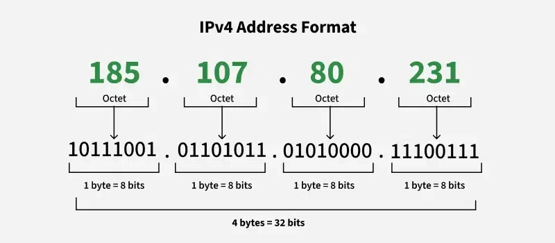
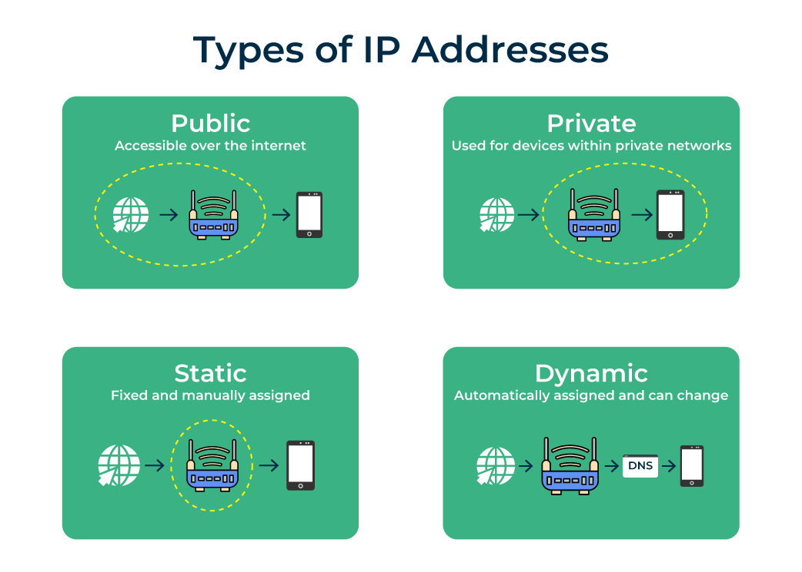
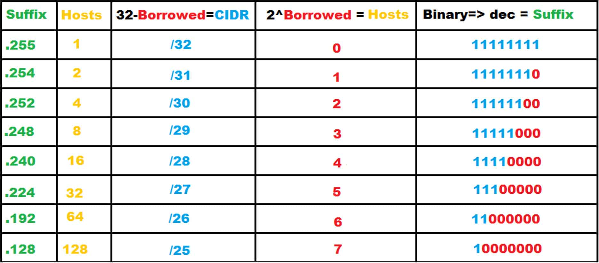

## Final Term Examination

### Topic List

> Thanks to **Amrin Jahan** for highlighting the important topics mentioned in **section 2**.

1. [**Definitions**](#definitions)
    - IP Address
    - Network Interface
    - Subnet
    - Subnetting
    - Supernetting
    - Host
    - NAT
    - CIDR
    - DHCP
    - Public Key
    - Private Key
    - IP Address Class
    - Private Address Space
    - VLSM
    - FLSM
    - Asymmetric Cryptography
    - Symmetric Cryptography
    - RSA
        - RSA Encryption
        - RSA Decryption
    - Flooding
    - Forwarding
    - Routing
    - Distance Vector Routing
    - Broadcast Storm
    - Reverse Path Forwarding
    - Spanning Tree Broadcast
    - Border Gateway Protocol
        - eBGP
        - iBGP
        - BGP Session
        - BGP Protocol Messages
    - Autonomous System
    - Scanning
        - Active Scanning
        - Passive Scanning
    - Base Station
    - Wireless Link
    - Handoff Infrastructure
    - Signal to Noise Ratio
    - Bit Error Rate
    - CDMA
    - CSMA/CA
    - CSMA/CD
    - Basic Service Set
    - Beacon Frames
    - Access Point
    - RTS and CTS
    - WiMax
    - Address Resolution Protocol
    - Ad Hoc Network

2. [**Theoretical Question**](#theoretical-questions)
    - **Chapter 4: IP Addressing and Subnetting**
        - [IP Address Structure](#41-ip-address-structure)
        - [IP Address Types](#42-ip-address-types)
        - [IP Address Classes](#43-ip-address-classes)
        - [IP Addressing Quick Guide](#44-ip-addressing-quick-guide)
        - [Why Subnetting is Necessary?](#45-why-subnetting-is-necessary)
        - [What is the slash notation in a subnet address?](#46-what-is-the-slash-notation-in-a-subnet-address)
        - [Classless Subnetting using CIDR](#47-classless-subnetting-using-cidr)
        - [How does a host get IP address within its network?](#48-how-does-a-host-get-ip-address-within-its-network)
        - [How does a network get IP address for itself?](#49-how-does-a-network-get-ip-address-for-itself)
        - [Why DHCP is better than manual routing?](#410-why-dhcp-is-better-than-manual-routing)
        - [What is NAT? Why it is useful?](#411-what-is-nat-why-it-is-useful)
        - [Private Address Space](#412-private-address-space)
        - [Classful vs Classless Addressing](#413-classful-vs-classless-addressing)
        - [VLSM vs FLSM](#414-vslm-vs-flsm)
        - [Example of VLSM and FLSM](#415-example-of-vlsm-and-flsm)

    - **Chapter 5: Routing Protocols**
        - [Routing Protocol Classification](#B)
        - [Dijkstra's Link State Routing Algorithm]()
        - [Distance Vector Algorithm]()

    - **Chapter 7: Wireless and Mobile Networks**
        - [Flooding: Pros and Cons](#B)
        - [Flooding: Broadcast Storm]()
        - [Flooding: Spanning Tree Broadcast]()
        - [Forwarding vs Routing]()
        - [Reverse Path Forwarding]()
        - [Distance Vector Algorithm]()
        - [Border Gateway Protocol with Example]()
        - [BGP Messages]()
        - [BGP Routes]()
        - [Elements of a Wireless Network]()
        - [Ad Hoc Mode]()
        - [Wireless Link Characteristics]()
        - [SNR vs BER]()
        - [IEEE 802.11 Wireless LAN Mechanism]()
        - [CSMA/CA and CSMA/CD]()
        - [IEEE 802.11 MAC Protocol: CSMA/CA]()
        - [IEEE 802.11 Frame Addressing]()
        - [WiMax]()

    - **Chapter 8: Network Security**
        - [Explain Asymmetric Cryptography](#B)
        - [Explain Symmetric Cryptography]()
        - [What is RSA?]()
        - [How does RSA encryption work?]()
        - [How does RSA content is decrypted?]()

3. **Mathematical Questions**
    - [IP Addressing](#11-ip-addressing)
    - [Variable Length Subnet Mask](#12-variable-length-subnet-mask)
    - [RSA Algorithm](#13-rsa-algorithm)

### Full Forms

| Abbreviation | Full Form                                              |
| :----------- | :----------------------------------------------------- |
| **IP**       | Internet Protocol                                      |
| **NAT**      | Network Address Translation                            |
| **DHCP**     | Dynamic Host Configuration Protocol                    |
| **CIDR**     | Classless Inter-Domain Routing                         |
| **VSLM**     | Variable Length Subnet Mask                            |
| **FSLM**     | Fixed Length Subnet Mask                               |
| **RSA**      | Rivest-Shamir-Adleman                                  |
| **RPF**      | Reverse Path Forwarding                                |
| **ACK**      | Acknowledgement                                        |
| **DVR**      | Distance Vector Routing                                |
| **STP**      | Spanning Tree Protocol                                 |
| **BGP**      | Border Gateway Protocol                                |
| **eBGP**     | External BGP                                           |
| **iBGP**     | Internal/Logical BGP                                   |
| **AS**       | Autonomous System                                      |
| **SNR**      | Signal to Noise Ratio                                  |
| **BER**      | Bit Error Rate                                         |
| **CDMA**     | Code Division Multiple Access                          |
| **CSMA/CA**  | Carrier Sense Multiple Access with Collision Avoidance |
| **CSMA/CD**  | Carrier Sense Multiple Access with Collision Detection |
| **BSS**      | Basic Service Set                                      |
| **AP**       | Access Point                                           |
| **RTS**      | Request to Send                                        |
| **CTS**      | Clear to Send                                          |
| **WiMax**    | Worldwide Interoperability for Microwave Access        |
| **ARP**      | Address Resolution Protocol                            |
| **MANET**    | Mobile Ad Hoc Network                                  |
| **WANET**    | Wireless Ad Hoc Network                                |
| **FANET**    | Flying Ad Hoc Network                                  |
| **VANET**    | Vehicular Ad hoc Network                               |
| **ISP**      | Internet Service Provider                              |

### Definitions

- <ins><strong>IP Address:</strong></ins> An IP (Internet Protocol) address is a unique numerical label that acts as a digital address for identifying devices (hosts) and locating them.

- <ins><strong>Network Interface:</strong></ins> A Network Interface is the hardware or software component that enables a device to connect to a computer network and exchange data.

- <ins><strong>Subnet:</strong></ins> A subnet (subnetwork) is a logical subdivision of an IP network, dividing a large network into smaller, manageable, and more efficient segments.

- <ins><strong>Subnetting:</strong></ins> Subnetting is the process of dividing a large IP network into smaller logical networks called subnets.

- <ins><strong>Supernetting:</strong></ins> Supernetting is a network technique that combines multiple smaller, contiguous IP networks (subnets) into a single, larger network, or supernet.

- <ins><strong>Host:</strong></ins> A network host is a computer or other device connected to a computer network.

- <ins><strong>NAT:</strong></ins> Network Address Translation (NAT) is a method used by routers to map multiple private IP addresses from a local network to a single public IP address for internet access.

- <ins><strong>CIDR:</strong></ins> Classless Inter-Domain Routing (CIDR) is a method for allocating IP addresses and routing IP packets more efficiently than the old class-based system.

- <ins><strong>DHCP:</strong></ins> Dynamic Host Configuration Protocol (DHCP) is a network management protocol that automatically assigns unique IP addresses to devices connected to a network.

- <ins><strong>Public Key & Private Key:</strong></ins> Public and private keys are a pair of long, alphanumeric strings used in asymmetric cryptography to secure digital information.

    The public key is shared openly to encrypt data or verify signatures, while the private key is kept secret by the owner to decrypt data or create digital signatures.

- <ins><strong>IP Address Class:</strong></ins> IP address classes (Classful Networking) are a method for dividing IPv4 addresses into five distinct categories (A, B, C, D, and E) to structure network sizes.

- <ins><strong>Private Address Space:</strong></ins> Private Address Space consists of reserved IP address ranges (defined by **RFC 1918**) used for internal networks (LANs), such as homes and offices, which are not routable on the public internet.

- <ins><strong>VSLM:</strong></ins> Variable Length Subnet Mask (VLSM) is an IP addressing technique that allows network engineers to divide an IP address space into subnets of different sizes.

- <ins><strong>FLSM:</strong></ins> FLSM (Fixed Length Subnet Mask) is a subnetting technique where all subnets in a network are designed to have an identical size and subnet mask.

- <ins><strong>Asymmetric Cryptography:</strong></ins> Asymmetric cryptography, is a security system that uses a pair of mathematically related keys: a public key for encryption (_freely shared_) and a private key for decryption (_kept secret_).

- <ins><strong>Symmetric Cryptography:</strong></ins> Symmetric cryptography is a type of encryption where a single, shared secret key is used for both encrypting and decrypting data.

- <ins><strong>RSA Encryption:</strong></ins> RSA (Rivest-Shamir-Adleman) encryption is a foundational asymmetric public-key cryptographic system widely used to secure sensitive data transmission.

- <ins><strong>RSA Decryption:</strong></ins> RSA decryption is the process of reverting ciphertext back into its original plaintext using a private key in the asymmetric RSA algorithm.

- <ins><strong>Flooding:</strong></ins> Flooding is a non-adaptive, static routing technique where a source node or router sends incoming packets out through every connected outgoing link, except the one used to receive the packet.

- <ins><strong>Forwarding:</strong></ins> Forwarding is the process where a router or switch receives a data packet on an input interface and moves it to the appropriate output interface, based on a forwarding table.

- <ins><strong>Routing:</strong></ins> Routing is the process of selecting the best path for data packets to travel across one or more interconnected networks from source to destination.

- <ins><strong>Distance Vector Routing:</strong></ins> Distance Vector Routing (DVR) is a protocol where each router keeps a table showing the distance (in hops) to all other routers.

- <ins><strong>Broadcast Storm:</strong></ins> A broadcast storm is a severe network performance issue where excessive broadcast or multicast traffic floods a network, causing it to slow down or completely collapse.

- <ins><strong>Reverse Path Forwarding:</strong></ins> Reverse Path Forwarding (RPF) is a network technique primarily used in multicast routing to prevent loops by verifying that a packet arrived on the interface closest to its source.

- <ins><strong>Spanning Tree Broadcast:</strong></ins> The Spanning Tree Protocol (STP) is a network protocol that builds a loop-free logical topology for Ethernet networks.

- <ins><strong>Border Gateway Protocol:</strong></ins> The Border Gateway Protocol (BGP) is the standardized exterior gateway protocol designed to exchange routing and reachability information among autonomous systems (AS) on the internet.
    - <ins><strong>eBGP:</strong></ins> eBGP is for talking between different networks.

    - <ins><strong>iBGP:</strong></ins> iBGP is for talking inside one network.

    - <ins><strong>BGP Session:</strong></ins> A BGP session is a reliable TCP-based connection (using **port 179**) between two routers, known as BGP peers or speakers, that exchange routing information to determine the best path for data across the internet.

    - <ins><strong>BGP Protocol Messages:</strong></ins> BGP Protocol Messages are the four fundamental packet types: Open, Update, Keepalive, and Notification.

- <ins><strong>Autonomous System:</strong></ins> An Autonomous System (AS) in BGP is a large, independently managed network or group of networks that shares a unified routing policy.

- <ins><strong>Active Scanning:</strong></ins> Active scanning involves sending direct probes or traffic to devices to detect vulnerabilities and gather detailed information.

    It is often used in penetration testing.

- <ins><strong>Passive Scanning:</strong></ins> Passive scanning involves monitoring existing network traffic without disrupting it to identify assets and vulnerabilities, providing a quieter, continuous, and non-intrusive security analysis.

- <ins><strong>Base Station:</strong></ins> A base station is a fixed radio transceiver that serves as the central hub for wireless communication networks, connecting mobile devices (phones, tablets) to the core network.

- <ins><strong>Wireless Link:</strong></ins> A wireless link is a communication connection that transfers data between devices using electromagnetic waves (radio or infrared) rather than physical cables.

- <ins><strong>Handoff Infrastructure:</strong></ins> Handoff infrastructure (or handover infrastructure) refers to the network components, protocols, and mechanisms that allow a mobile user to maintain a seamless connection, such as a voice call or data session, while moving between different base stations, access points, or network types.

- <ins><strong>Signal to Noise Ratio:</strong></ins> Signal-to-noise ratio (SNR) is a measure used to compare the level of a desired signal (like audio, data, or an image) to the level of background noise.

- <ins><strong>Bit Error Rate:</strong></ins> Bit Error Rate (BER) is the ratio of bits received in error to the total number of bits transmitted.

- <ins><strong>CDMA:</strong></ins> Code Division Multiple Access (CDMA) is a digital cellular technology that allows multiple users to share the same frequency band simultaneously without interference.

- <ins><strong>CSMA/CA:</strong></ins> Carrier Sense Multiple Access with Collision Avoidance (CSMA/CA) is a network contention protocol used primarily in wireless (Wi-Fi) networks to prevent data collisions.

- <ins><strong>CSMA/CD:</strong></ins> CSMA/CD (Carrier Sense Multiple Access with Collision Detection) is a network protocol used in wired Ethernet (IEEE 802.3) to manage shared transmission media. It allows devices to "listen" before transmitting, stop if a collision occurs, and wait a random time before retrying.

- <ins><strong>Basic Service Set:</strong></ins> A Basic Service Set (BSS) is the fundamental building block of an IEEE 802.11 (Wi-Fi) wireless local area network (WLAN).

- <ins><strong>Beacon Frames:</strong></ins> A beacon frame is a type of management frame in IEEE 802.11 WLANs.

- <ins><strong>Access Point:</strong></ins> An access point (AP) is a networking device that creates a wireless local area network (WLAN), typically in an office or large building.

- <ins><strong>RTS and CTS:</strong></ins> RTS (Request to Send) and CTS (Clear to Send) are hardware flow control signals used in serial communications (RS-232) and wireless networking (802.11) to manage data transmission, preventing data loss or collisions.

    RTS tells the receiver that a device wants to send data, and CTS tells the sender it is safe to transmit.

- <ins><strong>WiMax:</strong></ins> WiMAX (Worldwide Interoperability for Microwave Access) is a 4G-era wireless communication technology based on the IEEE 802.16 standard. It acts as a long-range, high-speed alternative to wired broadband.

- <ins><strong>Address Resolution Protocol:</strong></ins> ARP (Address Resolution Protocol) maps an IPv4 address to the corresponding MAC address on a local network so frames can be delivered to the correct device.

- <ins><strong>Ad Hoc Network:</strong></ins> An ad hoc network is a decentralized, temporary wireless network that connects devices directly without relying on central infrastructure like routers or access points.

### Theoretical Questions

#### 4.1. IP Address Structure

An IP address (Internet Protocol address) is a unique numerical identifier assigned to each device connected to a network. It allows devices such as computers, smartphones, servers, and IoT devices to identify each other and communicate over the Internet or a local network.

An IPv4 address is a 32-bit number, usually written in "Dotted Decimal" format. It consists of four numbers (octets) ranging from 0 to 255, separated by dots (e.g.: `192.168.1.15`)

 <i>figure 4.1: IPv4 Address Format</i>

The address is split into two logical parts. The split depends on the **Class** or **Subnet Mask**:

- **Network ID:** Identifies the network the device belongs to.
- **Host ID:** Identifies the specific device on that network.

---

#### 4.2. IP Address Types

IP address types are primarily categorized by their version, accessibility on the internet, and how they are assigned to a device.

1. **Protocol Version:** The two versions of Internet Protocol currently in use differ mainly in address length and format:
    - <ins><strong>IPv4 (Internet Protocol Version 4):</strong></ins> A 32-bit address represented as four decimal numbers (0-255) separated by dots (e.g., `192.168.1.1`). It supports about **4.3 billion** unique addresses.
    - <ins><strong>IPv6 (Internet Protocol Version 6):</strong></ins> A 128-bit address using hexadecimal digits separated by colons (e.g., `2001:0db8:85a3::8a2e:0370:7334`). It was developed to solve IPv4 address exhaustion and can support nearly unlimited addresses.

2. **Accessibility:** Addresses are split into two types based on whether they can be reached from the public internet.
    - <ins><strong>Public IP Address:</strong></ins> Assigned by an Internet Service Provider (ISP) to your router. It identifies your network globally and is necessary for online communication.
    - <ins><strong>Private IP Address:</strong></ins> Assigned by your router to individual devices (phones, laptops) inside your local network. These are not visible to the outside world, providing a layer of security.

3. **Assignment Method:** This refers to how a device receives its specific address and whether that address stays the same.
    - <ins><strong>Dynamic IP Address:</strong></ins> Automatically assigned by a DHCP server and changes periodically. Most home networks use dynamic IPs because they are cost-effective for ISPs.
    - <ins><strong>Static IP Address:</strong></ins> Manually assigned and remains constant over time. These are typically used for servers, website hosting, or remote access where a consistent address is required.

 <i>figure 4.2: IP Address Types</i>

---

#### 4.3. IP Address Classes

IPv4 addresses are divided into five classes (_A, B, C, D, and E_) based on the first octet, designed to manage network sizes ranging from massive **(Class A)** to small **(Class C)**. Classes A-C are used for **host addressing**, D for **multicasting**, and E for **research**. Each class has a **default subnet mask**.

- Class A (**1–126**),
- Class B (**128–191**),
- Class C (**192–223**)

| Class | First Octet Range | Default Subnet Mask                   | Purpose               |
| :---- | :---------------- | :------------------------------------ | :-------------------- |
| A     | 0 – 127           | 255.0.0.0 (network bits: **/8**)      | Large networks        |
| B     | 128 – 191         | 255.255.0.0 (network bits: **/16**)   | Medium networks       |
| C     | 192 – 223         | 255.255.255.0 (network bits: **/24**) | Small networks        |
| D     | 224 – 239         | N/A                                   | Multicast             |
| E     | 240 – 255         | N/A                                   | Experimental/Research |

#### 4.4. IP Addressing Quick Guide

IP addressing is a method of assigning unique numerical labels to devices for identification on a network.

**Core Types:**

- **IPv4:** Uses a 32-bit address, written in dotted-decimal format.
- **IPv6:** Uses a 128-bit address written in hexadecimal.

**Static vs. Dynamic Addressing:**

- **Static IP:** Manually assigned, permanent, and often used for servers.
- **Dynamic IP:** Automatically assigned by a DHCP server, common for end-user devices.

**Public vs. Private IP Addresses:**

- **Public IP:** Routable on the internet, assigned by an ISP.
- **Private IP:** Used within local networks (e.g., home/office) and not directly accessible from the internet.

**Classful and Classless Addressing:**

- **Classful Addressing:** Divides IPv4 addresses into classes (**A-E**) based on the first octet.
- **Classless Inter-Domain Routing (CIDR):** Replaced classful addressing to improve efficiency by allowing flexible network sizing using a subnet mask or prefix length (_e.g., /27_)

**Special Purpose IP Addresses:**

- **Loopback Address (127.0.0.1)**: Used by a computer to test its own network interface.
- **Default Gateway (0.0.0.0)**: Represents an unknown or default network target.
- **Automatic Private IP Addressing (APIPA)**: Assigned automatically (_169.254.0.1_ to _169.254.254.254_) if DHCP fails.

---

#### 4.5. Why Subnetting is Necessary?

Subnetting is essential to break down large, inefficient networks into smaller, manageable subnets.

- <ins><strong>Improves Network Performance:</strong></ins> Subnetting divides large broadcast domains into smaller ones. This limits the spread of broadcast traffic, which minimizes congestion and increases overall network speed.

- <ins><strong>Enhances Security:</strong></ins> Subnets act as logical boundaries, allowing network administrators to isolate sensitive systems (e.g., separating a finance department network from public Wi-Fi). If a security breach occurs, it is likely contained within that single subnet rather than impacting the entire network.

- <ins><strong>Manages IP Addresses Efficiently:</strong></ins> Subnetting prevents the waste of IP addresses by enabling the allocation of smaller, right-sized blocks of addresses rather than using a large, wasteful block for a small group of devices.

---

#### 4.6. What is the slash notation in a subnet address?

Slash notation (or **CIDR notation**) is a compact, shorthand method for representing an IP address and its associated subnet mask by indicating the number of masked network bits. A **forward slash (/)** is followed by a number (**0-32** for **IPv4**, **0-128** for **IPv6**), representing how many bits of the IP are used for the network address.

 <i>figure 4.6: Slash notation</i>

---

#### 4.7. Classless Subnetting using CIDR

Classless Inter-Domain Routing (CIDR) is a method for allocating IP addresses and IP routing that eliminates traditional classful boundaries (A, B, C) by using Variable Length Subnet Masks (VLSM). It allows networks to be divided into custom sizes (e.g., `/25`, `/29`) using a prefix-based notation, significantly reducing IPv4 exhaustion and improving routing efficiency.

> **CIDR Notation:** An IP address is followed by a forward slash and the number of bits used for the network prefix (e.g., `192.168.1.0/24`).

<ins><strong>Calculating CIDR Subnets:</strong></ins>

- **Determine Prefix Length (n):** The number of bits used for the network ID.
- **Calculate Subnets:** Number of subnets = `2 ^ x`, where `x` is the number of borrowed host bits.
- **Calculate Hosts per Subnet:** Total hosts = `(2 ^ y) - 2`, where `y` is the number of remaining host bits.

<ins><strong>Example:</strong></ins> If a company needs to split `192.168.1.0/24` into four subnets, they would use a `/26 prefix` (borrowing **2 bits**, 2 ^ 2 = 4 subnets).

- **Subnet 1:** `192.168.1.0/26` (Range: **.0 - .63**)
- **Subnet 2:** `192.168.1.64/26` (Range: **.64 - .127**)
- **Subnet 3:** `192.168.1.128/26` (Range: **.128 - .191**)
- **Subnet 4:** `192.168.1.192/26` (Range: **.192 - .255**)

<ins><strong>Common CIDR Block Examples:</strong></ins>

- **/24:** `255.255.255.0` (254 usable hosts)
- **/25:** `255.255.255.128` (126 usable hosts)
- **/26:** `255.255.255.192` (62 usable hosts)
- **/27:** `255.255.255.224` (30 usable hosts)
- **/28:** `255.255.255.240` (14 usable hosts)
- **/29:** `255.255.255.248` (6 usable hosts)
- **/30:** `255.255.255.252` (2 usable hosts - common for _WAN links_)

---

#### 4.8. How does a host get IP address within its network?

A host gets an IP address within its network primarily through Dynamic Host Configuration Protocol (DHCP), which automatically assigns unique IP addresses from a router's pool.

The process, known as **DORA**, involves four steps: Discover (client finds server), Offer (server offers IP), Request (client accepts), and Acknowledge (server confirms)

---

#### 4.9. How does a network get IP address for itself?

A network (specifically a router) typically obtains its public IP address from an Internet Service Provider (ISP) using DHCP (Dynamic Host Configuration Protocol). The ISP assigns this address automatically, often leasing it temporarily, to enable connection to the internet.

---

#### 4.10. Why DHCP is better than manual routing?

DHCP (Dynamic Host Configuration Protocol) is generally better than manual (static) IP address assignment because it automates the network configuration process, saving significant time and reducing errors, especially as network size increases.

1. **Automation and Efficiency**
    - Zero Configuration for Users.
    - Scalable.
    - Prevents Human Error.

2. **Centralized Management**
    - **Single Point of Control:** Network administrators manage the entire IP address range (scope) from a single server or router.
    - **Easy Reconfiguration:** If the network gateway or DNS server changes, you only update it once in the DHCP server, rather than visiting every single device.
    - **Remote Management:** You can change or update network settings for devices remotely, removing the need for physical access.

3. **IP Address Optimization**
    - DHCP uses a "lease" system, meaning IP addresses are rented to devices. When a device disconnects (e.g., a guest leaves), its address is automatically returned to the pool, allowing it to be assigned to a new device. By reusing addresses, DHCP prevents the network from running out of available IP addresses, a common problem in busy environments like cafes or offices.

4. **Mobility and Flexibility**
    - Laptops and mobile devices that move between networks (e.g., home, office, cafe) automatically obtain a valid IP for the new network without the user having to reconfigure settings.

---

#### 4.11. What is NAT? Why it is useful?

Network Address Translation **(NAT)** is a technique used by routers and firewalls to map multiple private IP addresses from a local network into a single, public IP address for internet access. It is crucial for conserving IPv4 addresses, enhancing security by hiding internal network structure, and allowing seamless connectivity for numerous devices in homes or businesses.

It supports techniques like port forwarding, allowing specific services inside the private network (like a web server) to be accessible from the outside, despite having a private IP.

By acting as an intermediary, NAT conceals internal network devices (computers, smartphones, IoT devices) from the public internet. Incoming unsolicited traffic is often blocked, as it doesn't match an established outgoing session.

<ins><strong>Common Usage Examples:</strong></ins>

- **Residential/Home WiFi Routers:** Your home router uses NAT to allow all your phones, laptops, and smart TVs to share the single IP address assigned by your Internet Service Provider (ISP).
- **Corporate Networks:** Companies use NAT to connect large office networks to the internet, often using a few public IP addresses for thousands of users, managing them through firewalls.
- **Cloud Computing:** Virtual private clouds (VPC) in AWS, Azure, or GCP use NAT gateways to enable internet access for resources (virtual machines) while keeping them in private subnets.

---

#### 4.12. Private Address Space

Private Address Space is a set of reserved IP ranges defined by RFC 1918 for internal networks (LANs), allowing devices to communicate without being directly routable on the public internet. These addresses are used by home, office, and enterprise networks, typically requiring Network Address Translation (NAT) to access the internet.

<ins><strong>Key Characteristics:</strong></ins>

- Non-Routable
- Reusable
- Uses NAT
- Private Network Use
- Cannot Register

<ins><strong>Reserved Private Address Ranges:</strong></ins>

According to ARIN and IPv4 Global, the following ranges are reserved:

- **Class A:** 10.0.0.0 - 10.255.255.255 (`10.0.0.0/8`)
- **Class B:** 172.16.0.0 - 172.31.255.255 (`172.16.0.0/12`)
- **Class C:** 192.168.0.0 - 192.168.255.255 (`192.168.0.0/16`)

---

#### 4.13. Classful vs Classless Addressing

| Parameter           | Classful&nbsp;Addressing                                                                                                                           | Classless&nbsp;Addressing                                                                                         |
| :------------------ | :------------------------------------------------------------------------------------------------------------------------------------------------- | :---------------------------------------------------------------------------------------------------------------- |
| **Definition**      | In Classful addressing IP addresses are allocated according to the classes- A to E.                                                                | Classless addressing came to replace the classful addressing and to handle the issue of allocation of IP Address. |
| **Network/Host ID** | The changes in the Network ID and Host ID depend on the class.                                                                                     | There is no such restriction of class in classless addressing.                                                    |
| **VLSM**            | It does not support the Variable Length Subnet Mask (VLSM).                                                                                        | It supports the Variable Length Subnet Mask (VLSM).                                                               |
| **Bandwidth**       | Classful addressing requires more bandwidth. As a result, it becomes slower and more expensive as compared to classless addressing.                | It requires less bandwidth. Thus, fast and less expensive as compared to classful addressing.                     |
| **CIDR**            | It does not support Classless Inter-Domain Routing (CIDR).                                                                                         | It supports Classless Inter-Domain Routing (CIDR).                                                                |
| **Troubleshooting** | Troubleshooting and problem detection are easy than classless addressing because of the division of network, host and subnet parts in the address. | It is not as easy compared to classful addressing.                                                                |

---

#### 4.14. VSLM vs FLSM

| Feature               | VLSM                                                                                                                                                                | FLSM                                                                                                                               |
| :-------------------- | :------------------------------------------------------------------------------------------------------------------------------------------------------------------ | :--------------------------------------------------------------------------------------------------------------------------------- |
| Subnet Size           | VLSM creates subnets with different sizes, tailored to the specific needs of each subnet.                                                                           | FLSM creates all subnets with an equal number of hosts.                                                                            |
| Subnet Mask           | VLSM uses different subnet masks for each subnet.                                                                                                                   | FLSM uses the same mask for all subnets.                                                                                           |
| IP Address Efficiency | VLSM minimizes IP address waste, making it highly efficient.                                                                                                        | FLSM has significant wastage of IP addresses because every subnet is sized for the largest requirement.                            |
| Routing Protocols     | VLSM requires classless routing protocols (like RIPv2, OSPF, EIGRP) that support CIDR.                                                                              | FLSM is often used with classful routing protocols.                                                                                |
| Complexity            | VLSM is more complex but more flexible.                                                                                                                             | FLSM is simpler to plan and implement.                                                                                             |
| Usage                 | Use VLSM when maximizing IP address space is crucial, or when subnets require vastly different numbers of hosts (e.g., one subnet needs 100 hosts, another needs 5) | Use FLSM when subnet sizes are intended to be identical, or in simpler, small networks where IP address scarcity is not a concern. |

---

#### 4.15. Example of VLSM and FLSM

<ins><strong>Fixed Length Subnet Mask (FLSM) Example</strong></ins>

In FLSM, every subnet is sized to match the largest required department, wasting addresses in smaller departments.

- **Requirement:** `192.168.1.0/24` divided into 4 subnets for departments of 50, 40, 20, and 10 hosts.
- **Method:** To fit 50 hosts, we need a block size of 64 (`2 ^ 6`). All 4 subnets will use a /26 mask (`255.255.255.192`)
- **Result:**
    - **Subnet 1**: `192.168.1.0/26` (Hosts: 50)
    - **Subnet 2:** `192.168.1.64/26` (Hosts: 40)
    - **Subnet 3:** `192.168.1.128/26` (Hosts: 20)
    - **Subnet 4:** `192.168.1.192/26` (Hosts: 10)
- **Waste:** Significant waste in **Subnets 3 and 4** (`64 - 2` usable addresses, but only `20/10` needed)

<ins><strong>Variable Length Subnet Mask (VLSM) Example</strong></ins>

VLSM optimizes space by subnetting again, applying smaller masks for smaller needs.

- **Requirements:** 50, 40, 20, 10 hosts.
- **Step 1:** Sort requirements (Largest first): 50, 40, 20, 10.
- **Step 2:** Assign masks based on size:
    - 50 hosts (64 needed): 192.168.1.0/26 (Range: 0-63)
    - 40 hosts (64 needed): 192.168.1.64/26 (Range: 64-127)
    - 20 hosts (32 needed): 192.168.1.128/27 (Range: 128-159)
    - 10 hosts (16 needed): 192.168.1.160/28 (Range: 160-175)
- **Result:** The remaining address space (`192.168.1.176 - 192.168.1.255`) is saved, improving efficiency.

### Mathematical Questions

#### 1.1. IP Addressing

#### 1.2. Variable Length Subnet Mask

#### 1.3. RSA Algorithm
